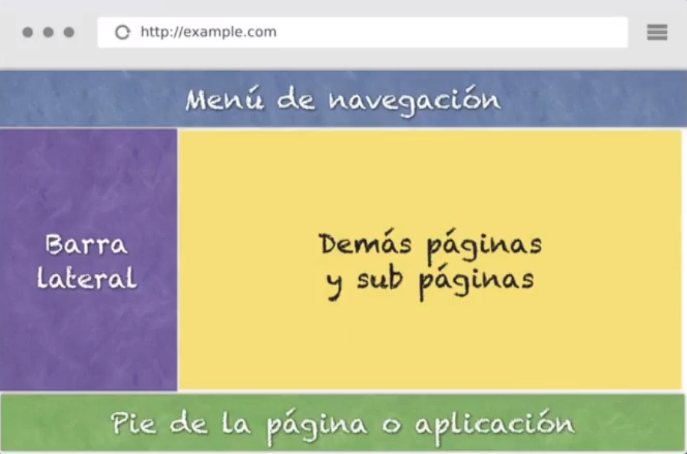
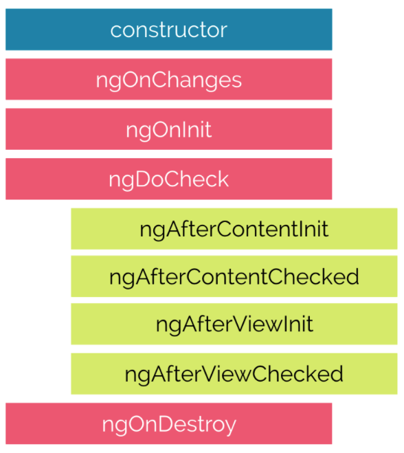
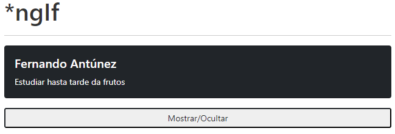
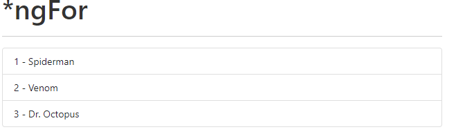
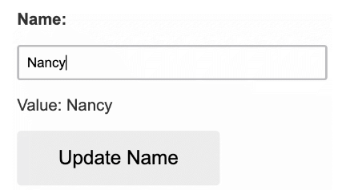

# Curso Base de Angular 17

* [Proyecto de Angular](#proyecto-de-angular)
* [Combados básicos](#combados-básicos)
* [Estructura de un proyecto de Angular](#estructura-de-un-proyecto-de-angular)
* [Componentes](#componentes)
  * [Ciclo de vida](#ciclo-de-vida)
    * [ngOnChanges](#ngonchanges)
    * [ngOnInit](#ngoninit)
    * [ngDoCheck](#ngdocheck)
    * [ngAfterContentInit](#ngaftercontentinit)
    * [ngAfterContentChecked](#ngaftercontentchecked)
    * [ngAfterViewInit](#ngafterviewinit)
    * [ngAfterViewChecked](#ngafterviewchecked)
    * [ngOnDestroy](#ngondestroy)
  * [Standalone](#standalone)
* [Servicios](#servicios)
    * [Peticiones HTTP](#peticiones-http)
      * [Get](#Get)
      * [Post](#Post)
      * [Put](#Put)
      * [Delete](#Delete)
* [Directivas](#directivas)
  * [ngIf](#ngif)
  * [ngIfElse](#ngifelse)
  * [ngFor](#ngfor)
  * [ngStyle](#ngstyle)
  * [ngClass](#ngclass)
  * [ngSwitch](#ngswitch)
  * [ng-container](#ng-container)
  * [ng-template](#ng-template)
  * [Directivas personalizadas](#directivas-personalizadas)
* [Pipes](#pipes)
  * [Uppercase](#uppercase)
  * [Lowercase](#lowercase)
  * [TitleCase](#titlecase)
  * [Slice](#slice)
  * [Decimal](#decimal)
  * [Percent](#percent)
  * [Currency](#currency)
  * [Json](#json)
  * [Async](#async)
  * [Date](#date)
  * [i18nSelect](#i18nselect)
  * [i18Plural](#i18plural)
  * [KeyValue](#keyvalue)  
  * [Pipes personalizados](#pipes-personalizados) 
* [Guard](#guard)
* [Módulos](#módulos)
* [Decoradores](#decoradores)
  * [@Input](#input)
  * [@Output](#output)
  * [@ViewChild](#viewchild)
  * [@ViewChildren](#viewchildren)
* [Template Forms](#template-forms)
* [Reactive Forms](#reactive-forms)
  * [FormControl](#formcontrol)
  * [FormGroup](#formgroup)
      * [FormGroup.get()](#formgroupget)
      * [FormGroup.setValue()](#formgroupsetvalue)
      * [FormGroup.reset()](#formgroupreset)
      * [FormGroup.valueChanges](#formgroupvaluechanges)
      * [FormGroup.statusChanges](#formgroupstatuschanges)
  * [FormBuilder](#formbuilder)
  * [Nested Forms](#nested-forms)
  * [FormArray](#formrray)
      * [FormArray.push()](#formarraypush)
      * [FormArray.removeAt()](#formarrayremoveat)
  * [Validators](#validators)
    * [Validaciones sincrónicas](#validaciones-sincrónicas)
    * [Validaciones asíncronas](#validaciones-asíncronas)
* [Navegación en Angular](#navegación-en-angular)
  * [Routes File](#routes-file)
  * [RouterModule.forRoot vs RouterModule.forChild](#routermoduleforroot-vs-routermoduleforchild)
  * [Lazy Loading](#lazy-loading)
  * [RouterLink y RouterLinkActive](#routerlink-y-routerlinkactive)
  * [Router](#router)
  * [ActivatedRoute](#activatedroute)  
  * [Rutas Anidadas](#rutas-anidadas)  
* [i18n](#i18n)
  * [Cambio global del idioma](#cambio-global-del-idioma)
* [Storage](#storage)
  * [Local Storage](#local-storage)
  * [Session Storage](#session-storage)  
* [Novedades Angular 14](#novedades-angular-14)
  * [Angular 14 - Standalone Componentes](#angular-14---standalone-componentes)
  * [Angular 14 - Tipado de Formulario](#angular-14---tipado-de-formulario)
  * [Angular 14 - Streamlined page title accessibility](#angular-14---streamlined-page-title-accessibility)
  * [Angular 14 - Extended developer diagnostics](#angular-14---extended-developer-diagnostics)
  * [Angular 14 - New primitives in the Angular CDK](#angular-14---new-primitives-in-the-angular-cdk)
  * [Angular 14 - Angular CLI enhancements](#angular-14---angular-cli-enhancements)
  * [Angular 14 - Angular DevTools is available offline and in Firefox](#angular-14---angular-devTools-is-available-offline-and-in-firefox)
  * [Angular 14 - Experimental ESM Application Builds](#angular-14---experimental-esm-application-builds)
* [Novedades Angular 15](#novedades-angular-15)
  * [Angular 15 - Aplicaciones sin módulos](#angular-15---aplicaciones-sin-módulos)
  * [Angular 15 - Lazy Loading de componentes](#angular-15---lazy-loading-de-componentes)
  * [Angular 15 - Mejoras en la carga de imágenes](#angular-15---mejoras-en-la-carga-de-imágenes)
  * [Angular 15 - Guardianes de rutas como funciones](#angular-15---guardianes-de-rutas-como-funciones)
  * [Angular 15 - Mejoras en el formato de errores](#angular-15---mejoras-en-el-formato-de-errores)
  * [Angular 15 - Angular Material alienado con Material Design 3](#angular-15---angular-material-alienado-con-material-design-3)
  * [Angular 15 - Nueva utilidad en Angular CDK](#angular-15---nueva-utilidad-en-angular-cdk)
  * [Angular 15 - Construcciones más rápidas con ESBuild](#angular-15---construcciones-más-rápidas-con-esbuild)
  * [Angular 15 - Menos archivos menos estrés](#angular-15---menos-archivos-menos-estrés)
  * [Angular 15 - Elige tu herramienta de testing para e2e](#angular-15---elige-tu-herramienta-de-testing-para-e2e)
* [Novedades Angular 16](#novedades-angular-16)
  * [Angular 16 - Reactividad rediseñada con Signals](#angular-16---reactividad-rediseñada-con-signals)
  * [Angular 16 - Interoperabilidad con RxJS](#angular-16---interoperabilidad-con-rxjs)
  * [Angular 16 - Renderizado en el lado del servidor SSR](#angular-16---renderizado-en-el-lado-del-servidor-ssr)
  * [Angular 16 - Creación de proyectos independientes desde cero](#angular-16---creación-de-proyectos-independientes-desde-cero)
  * [Angular 16 - Configuración de Zone.js](#angular-16---configuración-de-zonejs)
  * [Angular 16 - Vista previa de desarrolladores basado en esbuild](#angular-16---vista-previa-de-desarrolladores-basado-en-esbuild)
  * [Angular 16 - Mejor prueba unitaria con Jest y Web Test Runner](#angular-16---mejor-prueba-unitaria-con-jest-y-web-test-runner)
  * [Angular 16 - Autocompletar importaciones en las plantillas](#angular-16---autocompletar-importaciones-en-las-plantillas)
  * [Angular 16 - Entradas requeridas](#angular-16---entradas-requeridas)
  * [Angular 16 - Pasar datos del enrutador como entradas del componente](#angular-16---pasar-datos-del-enrutador-como-entradas-del-componente)
  * [Angular 16 - Soporte de CSP para estilos en línea](#angular-16---soporte-de-csp-para-estilos-en-línea)
  * [Angular 16 - ngOnDestroy flexible](#angular-16---ngondestroy-flexible)
  * [Angular 16 - Etiquetas de cierre automático](#angular-16---etiquetas-de-cierre-automático)
* [Novedades Angular 17](#novedades-angular-17)
  * [Angular 17 - Nuevo Logo y Nuevo sitio web de documentación](#angular-17---nuevo-logo-y-nuevo-sitio-web-de-documentación)
  * [Angular 17 - Migración Automática a la Nueva Sintaxis](#angular-17---migración-automática-a-la-nueva-sintaxis)
  * [Angular 17 - Nuevos Flujos de Control](#angular-17---nuevos-flujos-de-control)
  * [Angular 17 - Vistas Diferidas (Lazy Loading)](#angular-17---vistas-diferidas-lazy-loading)
  * [Angular 17 - Standlone por Defecto](#angular-17---standlone-por-defecto)
  * [Angular 17 - Bucle For Incorporado](#angular-17---bucle-for-incorporado)
  * [Angular 17 - Signals Optimizados](#angular-17---signals-optimizados)
  * [Angular 17 - Esbuild y Vite por Defecto](#angular-17---esbuild-y-vite-por-defecto)
  * [Angular 17 - Depuración de Inyección de Dependencias en DevTools](#angular-17---depuración-de-inyección-de-dependencias-en-devtools)
  * [Angular 17 - Nuevas Validaciones](#angular-17---nuevas-validaciones)
* [Helpers Angular 17](#helpers-angular-17)
  * [structuredClone()](#structuredclone)


  

 
## Proyecto de Angular
Angular es un lenguaje basado en `componentes`, por lo general una app de angular se basa en múltiples componentes, como pudiesen ser el menú de navegación, barra lateral, páginas y subpáginas, pie de páginas, etc.



## Combados básicos
*   **`ng new app-name`:** Permite la creación de un nuevo proyecto de Angular bajo el nombre `app-name` y parámetros indicados.
    * Usamos la bandera **`--no-standalone`** para generar un proyecto basado en módulos sin el standalone.
*   **`ng serve`:** Permite instanciar el proyecto de angular en el puerto establecido por defecto levanta en el `4200`. 
    * Usamos la bandera **`-p`** para indicar el puerto donde deseamos que abra `ng serve -p 4201`.
    * Usamos la bandera **`-o`** para indicar que una vez que cargue, abra el navegador por defecto `ng serve -o`.
*   **`ng generate component ruta`:** Crea un nuevo componente en nuestro proyecto de angular en la ruta indicada, por default lo cera en la carpeta `app`, podemos abreviar la petición `ng g c components/footer`, Este comando creará el componente en la ruta `src/app/components/footer/footer.component.ts`.
    * Usamos la bandera **`-s`**`(--inline-style)` para generar componentes sin el archivo de estilos.
    * Usamos la bandera **`-t`**`(--inline-template)` para generar componentes sin la plantilla HTML en el component.ts.
    * Usamos la bandera **`--skip-tests`** para generar componentes sin el archivo `.spec`.
    * Usamos la bandera **`--flat`** para generar componentes en la ruta principal o en una especifica sin crear una carpeta que haga alusión al nombre del mismo.
*   **`ng generate service ruta`:** Crea un servicio en la ruta indicada, por default lo crea en la carpeta `app`, podemos abreviar la petición `ng g s services/spotify`, Este comando creará el servicio en la ruta `src/app/services/spotify.service.ts`.
    * Usamos la bandera **`--skip-tests`** para generar el servicio sin el archivo `.spec`.
    * Usamos la bandera **`--flat`** para generar componentes en la ruta principal o en una especifica sin crear una carpeta que haga alusión al nombre del mismo.
*   **`ng generate directive ruta`:** Crea una directiva personalizada en la ruta indicada, por default lo crea en la carpeta `app`, podemos abreviar la petición `ng g d directives/resaltado`, Este comando creará la directiva en la ruta `src/app/directives/resaltado/resaltado.directive.ts`.
    * Usamos la bandera **`--skip-tests`** para generar la directiva sin el archivo `.spec`.
    * Usamos la bandera **`--flat`** para generar componentes en la ruta principal o en una especifica sin crear una carpeta que haga alusión al nombre del mismo.
*   **`ng generate pipe ruta`:** Crea un pipe personalizado en la ruta indicada, por default lo crea en la carpeta `app`, podemos abreviar la petición `ng g p pipes/capitalizado`, Este comando creará el pipe en la ruta `src/app/pipes/capitalizado/capitalizado.pipe.ts`.
    * Usamos la bandera **`--flat`** para generar componentes en la ruta principal o en una especifica sin crear una carpeta que haga alusión al nombre del mismo.
*   **`ng generate guard ruta`:** Crea un guard en la ruta indicada, por default lo crea en la carpeta `app`, podemos abreviar la petición `ng g guard guards/auth`, Este comando creará la directiva en la ruta `src/app/guards/guard/auth.guard.ts`.
    * Usamos la bandera **`--skip-tests`** para generar el guard sin el archivo `.spec`.
    * Usamos la bandera **`--flat`** para generar componentes en la ruta principal o en una especifica sin crear una carpeta que haga alusión al nombre del mismo.
*   **`ng generate environments`:** Crea los archivos enviroments en la carpeta `src`, podemos abreviar la petición `ng g environments`, Este comando creará la carpeta en la ruta `src/environments/` con 3 archivos enviroments (`environment.development.ts`, `environment.staging.ts`, `environment.ts`).

## Estructura de un proyecto de Angular
```sh
├── .angular               //Carpeta destinada a almacenar el cache de Angular.
├── .vscode                //Carpeta propiamente del IDE de VSCode.
├── node_modules           //Carpeta destinada a los módulos de node.
├── src                    //Carpeta donde se guardara el source code del api
│   ├── app                //Carpeta estandar con la primera APP de angular.
│   │   ├── components     //Carpeta que contendrá los componentes a crear.
│   │   ├── directives     //Carpeta que contendrá las directivas a crear.
│   │   ├── guards         //Carpeta que contendrá los guards a crear.
│   │   ├── pipes          //Carpeta que contendrá los pipes a crear.
│   │   ├── services       //Carpeta que contendrá los servicios a crear.
│   │   ├── app.component.css      //Archivo de estilos del componente app.
│   │   ├── app.component.html     //Archivo html del componente app.
│   │   ├── app.component.spec.ts  //Archivo de pruebas automáticas del componente app
│   │   ├── app.component.ts       //Archivo de typescript del componente app
│   │   ├── app.module.ts          //Archivo de módulos del componente app
│   ├── assets             //Carpeta que contiene recursos estáticos (imágenes/librerías externas). 
│   │   ├── .gitkeep       //Archivo para mantener la carpeta al subir a un repositorio.
│   ├── environments       //Carpeta que contiene los ambientes de la APP.
│   │   ├── environment.development.ts    //Archivo con ambiente de desarrollo.
│   │   ├── environment.staging.ts        //Archivo con ambiente staging.
│   │   ├── environment.ts                //Archivo con ambiente de producción.
│   ├── favicon.ico        //Icono que representa la página en las pestañas.
│   ├── index.html         //Página web inicial que renderizar
│   ├── main.ts            //Archivo con el primer código a usar para lanzar la APP
│   ├── styles.css         //Archivo para manejar los estilos globales de la APP
├── .editconfig            //Archivo de configuraciones propías del editor.
├── .gitignore             //Archivo que permitirá que el repositorio de git ignore todos los archivos detallados en él
├── angular.json           //Archivo que permite indicarle a Angular el funcionamiento de la APP.
├── package.json           //Archivo donde se ven los paquetes o dependencias instaladas en el proyecto.
├── package-lock.json      //Archivo que deja un rastro de como fue creado el package.json
├── tsconfig.json          //Archivo que indicar los estándares de typescript a usar
├── tsconfig.app.json      //Archivo con configuraciones propias de typescript para la APP
├── tsconfig.spec.json     //Archivo con configuraciones propias para las pruebas de  typescript en la APP
└── README.md              //Información general del proyecto
```


## Componentes
Los `componentes` son clases con bloques de código re-utilizable que poseen un decorador específico y ejecután una acción en particular, consta básicamente de:
* **`Component.css`**: Archivo de estilos del componente app.
* **`Component.html`**: Archivo html del componente app.
* **`Component.spec.ts`**: Archivo de pruebas automáticas del componente app
* **`Component.ts`**: Archivo de typescript del componente app, incluirá:
  *   **`@Component`:** Decorador base de Angular que proporcionará datos de configuración a fin de indicar como procesar, instanciar y usar el componente en tiempo de ejecución.
  *   **`selector`:** Le indicará a Angular que cuando sea escogido deberá renderizar el `templateUrl`
  *   **`templateUrl`:** Ruta donde se encontrará la plantilla a renderizar
  *   **`template`:** Propiedad para crear un template inline `<hi>Hola  Mundo</hi>`
  *   **`styleUrls`:** Ruta del archivo estilo a aplicar (CSS, SASS, etc), unicamente al componente creado 

  ```ts
  import { Component } from '@angular/core';

  @Component({
    selector: 'app-header',
    templateUrl: './header.component.html',
    styleUrls: ['./header.component.css']
  })
  export class HeaderComponent {
  }
  ```

Para indicarle a angular que el componente creado es uno el cual puede utilizar basta con dirigirse al `app.module.ts`, importar la ruta del nuevo componente creado y declararlo en la sección `declarations`

```ts
import { BrowserModule } from '@angular/platform-browser';
import { NgModule } from '@angular/core';

import { AppComponent } from './app.component';
import { HeaderComponent } from './components/header/header.component'

@NgModule({
  declarations: [
    AppComponent,
    HeaderComponent
  ],
  imports: [
    BrowserModule
  ],
  providers: [],
  bootstrap: [AppComponent]
})
export class AppModule { }
```

### Ciclo de vida
El ciclo de vida de un componente o `lifecycle hook` esta compuesto por 8 etapas denominadas `lifecycle hook event` o `evento de enlace de ciclo de vida`




#### ngOnChanges
Este evento se ejecuta cada vez que se cambia un valor de un input control dentro de un componente. Se activa primero cuando se cambia el valor de una propiedad vinculada. Siempre recibe un change data map o mapa de datos de cambio, que contiene el valor actual y anterior de la propiedad vinculada envuelta en un SimpleChange
```ts
import { Component, OnChanges } from '@angular/core';

@Component({
  selector: 'app-home',
  template: `
    <app-ng-style></app-ng-style>`,
  styles: [
  ]
})
export class HomeComponent implements OnChanges {

  constructor() {}

ngOnChanges(){
  console.log("ngOnChanges");
}
```

#### ngOnInit
Se ejecuta una vez que Angular ha desplegado los data-bound properties(variables vinculadas a datos) o cuando el componente ha sido inicializado, una vez que ngOnChanges se haya ejecutado. Este evento es utilizado principalmente para inicializar la data en el componente.
```ts
import { Component, OnInit } from '@angular/core';

@Component({
  selector: 'app-home',
  template: `
    <app-ng-style></app-ng-style>`,
  styles: [
  ]
})
export class HomeComponent implements OnInit {

  constructor() {}

ngOnInit(){
  console.log("ngOnInit");
}
```

#### ngDoCheck
Se activa cada vez que se verifican las propiedades de entrada de un componente. Este método nos permite implementar nuestra propia lógica o algoritmo de detección de cambios personalizado para cualquier componente.
```ts
import { Component, DoCheck } from '@angular/core';

@Component({
  selector: 'app-home',
  template: `
    <app-ng-style></app-ng-style>`,
  styles: [
  ]
})
export class HomeComponent implements DoCheck {

  constructor() {}

ngDoCheck(){
  console.log("ngDoCheck");
}
```

#### ngAfterContentInit
Se ejecuta cuando Angular realiza cualquier muestra de contenido dentro de las vistas de componentes y justo después de ngDoCheck. Actuando una vez que todas las vinculaciones del componente deban verificarse por primera vez. Está vinculado con las inicializaciones del componente hijo.
```ts
import { Component, AfterContentInit } from '@angular/core';

@Component({
  selector: 'app-home',
  template: `
    <app-ng-style></app-ng-style>`,
  styles: [
  ]
})
export class HomeComponent implements AfterContentInit {

  constructor() {}

ngAfterContentInit(){
  console.log("ngAfterContentInit");
}
```

#### ngAfterContentChecked
Se ejecuta cada vez que el contenido del componente ha sido verificado por el mecanismo de detección de cambios de Angular; se llama después del método ngAfterContentInit. Este también se invoca en cada ejecución posterior de ngDoCheck y está relacionado principalmente con las inicializaciones del componente hijo.
```ts
import { Component, AfterContentChecked } from '@angular/core';

@Component({
  selector: 'app-home',
  template: `
    <app-ng-style></app-ng-style>`,
  styles: [
  ]
})
export class HomeComponent implements AfterContentChecked {

  constructor() {}

ngAfterContentChecked(){
  console.log("ngAfterContentChecked");
}
```

#### ngAfterViewInit
Se ejecuta cuando la vista del componente se ha inicializado por completo. Este método se inicializa después de que Angular ha inicializado la vista del componente y las vistas secundarias. Se llama después de ngAfterContentChecked. Solo se aplica a los componentes.
```ts
import { Component, AfterViewInit } from '@angular/core';

@Component({
  selector: 'app-home',
  template: `
    <app-ng-style></app-ng-style>`,
  styles: [
  ]
})
export class HomeComponent implements AfterViewInit {

  constructor() {}

ngAfterViewInit(){
  console.log("ngAfterViewInit");
}
```

#### ngAfterViewChecked
Se ejecuta después del método ngAfterViewInit y cada vez que la vista del componente verifique cambios. También se ejecuta cuando se ha modificado cualquier enlace de las directivas secundarias. Por lo tanto, es muy útil cuando el componente espera algún valor que proviene de sus componentes secundarios.
```ts
import { Component, AfterViewChecked } from '@angular/core';

@Component({
  selector: 'app-home',
  template: `
    <app-ng-style></app-ng-style>`,
  styles: [
  ]
})
export class HomeComponent implements AfterViewChecked {

  constructor() {}

ngAfterViewChecked(){
  console.log("ngAfterViewChecked");
}
```

#### ngOnDestroy
Este método se ejecutará justo antes de que Angular destruya los componentes. Es muy útil para darse de baja de los observables y desconectar los event handlers para evitar memory leaks o fugas de memoria.
```ts
import { Component, OnDestroy } from '@angular/core';

@Component({
  selector: 'app-home',
  template: `
    <app-ng-style></app-ng-style>`,
  styles: [
  ]
})
export class HomeComponent implements OnDestroy {

  constructor() {}

ngOnDestroy(){
  console.log("ngOnDestroy");
}
```

### Standalone
Los standalone components simplemente son components que no dependen necesariamente de ningún módulo.

Al no depender de ningún módulo:

* Son más simples de implementar.
* Son más flexibles de mover y reutilizar dentro de un mismo proyecto o moverlo a otro.
* Es independiente y se encarga de declarar sus importaciones necesarias que se usan en el componente.

```ts
import { CommonModule } from '@angular/common';
import { Component, type OnInit } from '@angular/core';

@Component({
  selector: 'app-new-test',
  standalone: true,
  imports: [CommonModule],
  templateUrl: './newTest.component.html',
  styleUrl: './newTest.component.scss'
})
export class NewTestComponent implements OnInit {}
```

Para los standalone en el decordar `@Component`, veremos como agregaremos nuevos selectores donde encontraremos
*   **`standalone`:** Booleano que indicará si el componente dependera de modulos
*   **`imports`:** Importación de los módulos a usar

Para la importación en lazy loading de un standalone componente basta con agregarlo a las rutas usando un `loadcomponent`

```ts
{
  path: 'test',
  loadComponent: () => import('./new-test'),
}
```


## Servicios
Los servicios  son clases que se encargan de acceder a los datos para entregarlos a los componentes, lo bueno de esto es que se puede reaprovechar servicios para distintos componentes. Para la creación de servicios podemos usar el angular CLI o hacerlo manualmente creando una carpeta `service` dentro de app y creando nuestro archivo bajo la nomenclatura `name.service.ts`

```ts
import { Injectable } from '@angular/core';

@Injectable({providedIn: 'root'})
export class HeroesService {
    constructor() { }    
}
```
> El decorador `providedIn: 'root'` es una manera automática de importar servicios sin agregar al `app.module.ts`

Una vez creado el servicio debemos agregarlo en la sección providers del `app.module.ts`
```ts
import { BrowserModule } from '@angular/platform-browser';
import { NgModule } from '@angular/core';

import { HeroesService } from "./service/heroes.service";

import { AppComponent } from './app.component';

@NgModule({
  declarations: [
    AppComponent
  ],
  imports: [
    BrowserModule
  ],
  providers: [
    HeroesService
  ],
  bootstrap: [AppComponent]
})
export class AppModule { }
```
> **RECORDATORIO:** Si tenemos el decordar `providedIn: 'root'` en nuestro servicios, este paso de importarlo en el `app.module.ts` pasa a ser opcional.

Para hacer uso del servicio basta con importarlo e inyectarlo en el constructor de nuestro componente, como buena practica el nombre de la variable sera el mismo nombre de la clase pero antecediendole un `_`
```ts
import { Component, OnInit } from '@angular/core';
import { HeroesService, Heroe } from "../../service/heroes.service";

@Component({
  selector: 'app-heroes',
  templateUrl: './heroes.component.html',
  styles: [
  ]
})
export class HeroesComponent implements OnInit {
  public heroes: Heroe[] = [];
  constructor(private _heroesService: HeroesService) {}

  ngOnInit(): void {
    this.heroes = this._heroesService.getHeroes();
    console.log(this.heroes);
  }
}
```
> Los servicios tendran variables de tipo privadas y el tipo será del mismo que la clase importada


### Peticiones HTTP
La mayoría de las aplicaciones front-end necesitan comunicarse con un servidor a través del protocolo HTTP para descargar o cargar datos y acceder a otros servicios back-end. Para usar el cliente HTTP de angular para hacer peticiones y consumir API REST usando los distintos métodos (GET, POST, PUT, DELETE, etc), es necesario importar el módulo propio de angular `HttpClientModule` en el `app.module.ts`
```ts
import { HttpClientModule } from "@angular/common/http";

@NgModule({
  declarations: [AppComponent],
  imports: [
    BrowserModule,
    HttpClientModule,
    RouterModule.forRoot(ROUTES, {useHash:true})
  ],
  providers: [],
  bootstrap: [AppComponent]
})
export class AppModule { }
```
Seguido de esto importamos la clase `HttpClient` de `@angular/common/http` en el componente/servicio donde lo vallamos a utilizar y lo inyectamos a su constructor 
```ts
import { Injectable } from '@angular/core';
import { HttpClient } from '@angular/common/http';

@Injectable()
export class ConfigService {
  constructor(private http: HttpClient) { }
}
```
La clase `HttpCliente` nos traerá los distintos métodos (GET, POST, PUT, DELETE) los cuales usaremos para relizar las peticiones
```ts
url = 'https://restcountries.eu/rest/v2/lang/es'
params = {name:'Fernando'}
// Get
this.http.get(url)
// Post
this.http.post(url, params)
//Put
this.http.put(url, params)
// Delete
this.http.post(url+'?id')
```
Estas peticiones devolveran un Observable con el tipo de dato que se le indiquen, por lo que es recomendable indicarlo en la función que llamará la petición
```ts
getProductos(): Observable<any>{
    return this.http.get(this.url+'productos');
}
```

#### GET
El método `GET` solicita una representación de un recurso específico. Las peticiones que usan el método GET sólo deben recuperar datos.

#### POST
El método `POST` se utiliza para enviar una entidad a un recurso en específico, causando a menudo un cambio en el estado o efectos secundarios en el servidor.
En angular un petición de tipo `POST` se compone de:
*   **`url`:** Sera de tipo `string` y representará endpoint a usar.
*   **`body`:** Puede ser de tipo `any` o de algún tipo que se le especifique en concreto (Por lo general suele ser un objeto) donde se almacenará la data. 
*   **`options`:** Es un objeto (*opcional*) en donde podremos pasarle campos extras como el headers de la petición en caso de ser requerido

```ts
// Una petición post estandar solo lleva la url y el body
crearHeroe(heroe: HeoreModel): Observable<any> {
  return this.http.post(url, heroe)
}

// en caso de desear agregar un campo opcional quedaría
crearHeroe(heroe: HeoreModel): Observable<any> {
  let headers = new HttpHeaders().set('Content-Type','application/x-www-form-urlencoded');
  return this.http.post(url, heroe, {headers: headers})
}
```

#### PUT
El modo `PUT` reemplaza todas las representaciones actuales del recurso de destino con la carga útil de la petición.

#### DELETE
El método `DELETE` borra un recurso en específico.


## Directivas
Las directivas son instrucciones para crear, formatear e interaccionar con el DOM. De hecho, los componentes son un tipo de directiva, ya que cuando usamos el selector de un componente, le estamos pidiendo a Angular que muestre dicho componente (y su lógica de programación) en algún lugar determinado del DOM. 

#### ngIf
Condicional del package `@angular/common` que permitira a través de su valor booleano ejecutar una sección del código HTML.

```html
<div *ngIf="false" class="card text-white bg-dark mb-3" style="width: 100%;">
    <div class="card-body">
        <h5 class="card-title">Fernando Antúnez</h5>
        <p class="card-text">Estudiar hasta tarde da frutos</p>                
    </div>
</div>
```

Este tipo de directiva condicionan eventos a fin de mostrar y/o eliminar elementos HTML.



```html
<div *ngIf="mostrar" class="card text-white bg-dark mb-3" style="width: 100%;">
  <div class="card-body">
      <h5 class="card-title">{{ frase.autor }}</h5>
      <p class="card-text">{{ frase.mensaje }}</p>
  </div>
</div>
<div class="d-grid gap-2">
    <button (click)="mostrar = !mostrar" class="bts btn-outline-dark btn-sm">
      Mostrar/Ocultar
    </button>
</div>
```
```ts
export class BodyComponent {
mostrar: boolean = true;
public frase : any = {
  mensaje: 'Estudiar hasta tarde da frutos',
  autor: 'Fernando Antúnez'
  }
}
```

#### ngIfElse
Condicional en caso de requerir un If-Else

```html
<ng-container *ngIf="expression; else elseTemplate">
  Condición cuando IF es true
</ng-container>
<ng-template #elseTemplate>
  Condición cuando IF es false
</ng-template>
```


#### ngFor
Condicional del package `@angular/common` que permitirá recorrer un arreglo. Se coloca en la etiqueta a repetir con la caracteristicas `*ngFor="let nombrePersonajes of personajes"` donde inicializamos una variable de nombre `nombrePersonajes` la cual tomará los elementos propios del arreglo `personajes`
```html
<ul class="list-group">
    <li *ngFor="let nombrePersonajes of personajes" class="list-group-item">
        {{ nombrePersonajes }}
    </li>
</ul>
```
```ts
export class BodyComponent {
  personajes : string[] = ['Spiderman', 'Venom', 'Dr. Octopus']
}
```
Dentro de la directiva `ngFor` podemos agregar código adicional separandolos con un `;` como sería el `index`

```html
<ul class="list-group">
    <li *ngFor="let nombrePersonajes of personajes; let i = index" class="list-group-item">
        {{ i + 1 }} - {{ nombrePersonajes }}
    </li>
</ul>
```  

Existen otras propiedades que podremos usar con el NgFor
* **index**: number: El índice del elemento actual en el iterable.
* **count**: number: La longitud del iterable.
* **first**: boolean: Verdadero cuando el elemento es el primer elemento del iterable.
* **last**: boolean: Verdadero cuando el elemento es el último elemento del iterable.
* **even**: boolean: Verdadero cuando el elemento tiene un índice par en el iterable.
* **odd**: boolean: Verdadero cuando el elemento tiene un índice impar en el iterable.

```html
<ul class="list-group">
    <li *ngFor="let nombrePersonajes of personajes; 
      let count = count;
      let first = isFirst;
      let last = isLast;
      let even = isEven;
      let odd = isOdd;">

        {{ i + 1 }} - {{ nombrePersonajes }}
    </li>
</ul>
```  

#### ngStyle
Una directiva de atributo que actualiza los estilos del elemento HTML que lo contiene desde el `component.ts`. Establece una o más propiedades de estilo, especificadas como pares clave-valor separados por dos puntos.

```ts
const styleExp: string = '40px'
const widthExp: number = 40;
const objExp: object = {
  'font-size': '15px',
  'color': 'red',
  'background-color': 'blue'
}

//Establece la fuente del elemento contenedor en el resultado de
//una expresión (styleExp).
<p [ngStyle]="{'font-size': styleExp}">A
</p>

//Establece el ancho del elemento contenedor en un valor de píxel
//devuelto por una expresión (widthExp).
<p [ngStyle]="{'max-width.px': widthExp}">E
</p>

//Establece una colección de valores de estilo mediante una
//expresión que devuelva pares clave-valor (objExp).
<p [ngStyle]="objExp">I
</p>
```

#### ngClass
Agrega y elimina clases CSS en un elemento HTML, su sintasis básica es escribir la propiedad `[ngClass]` seguida de la clase tipo string o variable que la acompañe. Las clases CSS se actualizan de la siguiente manera, según el tipo de evaluación de la expresión:

*   **`string`:** se agregan las clases CSS enumeradas en la cadena (delimitadas por espacios). Estas clases pueden venir escritas entre comillas simples dentro del `ngClass` o llamadas desde el `component.ts` desde alguna variable
    ```html
    <p [ngClass]="'first second'">...</p>
    <p [ngClass]="variable|stringExp|arrayExp|objExp">...</p>
    ```
*   **`Array`:** se agregan las clases CSS declaradas como elementos Array.
    ```html
    <p [ngClass]="['first', 'second']">...</p>
    ```
*   **`Object`:** las claves son clases CSS que se agregan cuando la expresión dada en el valor se evalúa como un valor `true`, de lo contrario, se eliminan.
    ```html
    <p [ngClass]="{'first': true, 'second': true, 'third': false}">...</p>
    <p [ngClass]="{'class1 class2 class3' : true}">...</p>
    ```

Otra manera de escribir clases en angular de manera dinamica es agregando entre corchetes la propiedad `[class]` seguida del nombre de la clase.
```ts
change = true;
```
```html
<p [class.isValid]="change">Validamos la clase</p>
```
En este caso usamos el booleano change para mostrar y ocultar la clase `isValid`


#### ngSwitch
La directiva ngSwitch es una directiva de atributo que evalúa una determinada variable. La misma se usa con otras 2 directivas:
* **`ngSwitchCase`**: Permite mostrar un elemento HTML dependiendo del valor de la variable evaluada en la directiva ngSwitch.
* **`ngSwitchDefault`**: Mostrará un elemento HTML en el caso de que no se muestre ningún ngSwitchCase. Esta directiva debe colocarse al final de todos los ngSwitchCase.


```ts
import { Component } from '@angular/core';

@Component({
  selector: 'app-ng-switch',
  templateUrl: './ng-switch.component.html',
  styles: [
  ]
})
export class NgSwitchComponent {
  alerta:string = 'info';
  constructor() { }
}
```
```html
<!--Evalua el elemento 'alerta'-->
<div [ngSwitch]="alerta">
    <div *ngSwitchCase="'success'">success</div>
    <div *ngSwitchCase="'info'">info</div>
    <div *ngSwitchCase="'warning'">warning</div>
    <div *ngSwitchDefault>danger</div>
</div>
```

#### ng-container
La directiva `ng-container` es una directiva estructural en Angular que nos crea un elemento HTML en la página, pero permite agrupar elementos HTML relacionados y aplicarles directivas y/o condiciones.
La directiva `ng-container` se utiliza a menudo en situaciones donde necesitamos utilizar una directiva estructural (por ejemplo, `*ngIf, *ngFor,`etc.) en un grupo de elementos HTML sin agregar un elemento adicional a la página.

```html
<ng-container *ngIf="mostrarElementos">
  <p>Elemento 1</p>
  <p>Elemento 2</p>
  <p>Elemento 3</p>
</ng-container>
```
> **Nota**: `ng-container` se utiliza para agrupar elementos sin introducir un nuevo elemento en el DOM.


#### ng-template
La directiva `ng-template` es una directiva estructural en Angular que se utiliza para definir plantillas de renderizado que no se muestran directamente en la página, pero que se pueden utilizar para renderizar contenido dinámicamente.

```html
<ul>
  <ng-template ngFor let-item [ngForOf]="items">
    <li>{{ item }}</li>
  </ng-template>
</ul>
```
También podemos asignar un nombre a la plantilla utilizando la directiva ng-template y luego hacer referencia a ella en otro lugar de la página utilizando la directiva `ngTemplateOutlet`.

```html
<ng-template #miPlantilla>
  <p>Contenido de la plantilla</p>
</ng-template>

<div>
  <h2>Título</h2>
  <ng-container *ngTemplateOutlet="miPlantilla"></ng-container>
</div>
```

> **Nota**: `ng-template` se utiliza para definir plantillas que no se representan directamente en el DOM, sino que se utilizan para renderizar contenido dinámicamente.


#### Directivas personalizadas
Al igual que existen directivas que son más habituales de usar creadas por el mismo angular como sería [ngIf](#ngif), [ngFor](#ngfor), [ngStyle](#ngstyle), [ngClass](#ngclass), etc... Existe la posibilidad de crear nuestras propias directivas con el comando `ng generate directive ruta`

```ts
import { Directive } from '@angular/core';

@Directive({
  selector: '[appResaltado]'
})
export class ResaltadoDirective {

  constructor() { console.log('Directiva personalizada') }
}
```

Podemos hacer uso de dicha directiva desde nuestro html llamándola en la etiqueta de nuestra preferencia
```html
<p appResaltado> Hola mundo</p>
```

Nuestra directiva podremos configurarla desde el archivo TS según la necesidad que tengamos importando las clases que requiramos a fin de modificar nuestro DOM.
```ts
import { Directive, ElementRef, HostListener } from '@angular/core';

@Directive({
  selector: '[appResaltado]'
})
export class ResaltadoDirective {

  // Evento que escucha cuando el mouse pasa por la etiqueta
  @HostListener('mouseenter') mouseEntro(){
    this.elementRef.nativeElement.style.backgroundColor = 'yellow';
  }

  // Evento que escucha cuando el mouse sale de la etiqueta
  @HostListener('mouseleave') mouseSalio(){
    this.elementRef.nativeElement.style.backgroundColor = null;
  }

  constructor(private elementRef:ElementRef) {}
}
```
De igual manera podremos mandar parámetros a nuestra directiva personalizada desde nuestro HTML, para ello basta con poner entre llaves nuestra directiva e igualarla con el parámetro a mandar, en nuestro archivo TS de nuestra directiva debemos usar el decorador [@Input](#input) a fin de recibir el parámetro a usar
```html
<p [appResaltado] = "'orange'">Hola mundo</p>
```
```ts
import { Directive, ElementRef, HostListener, Input,  } from '@angular/core';

@Directive({
  selector: '[appResaltado]'
})
export class ResaltadoDirective {

  @Input("appResaltado") nuevoColor:string

  @HostListener('mouseenter') mouseEntro(){
    this.resaltar(this.nuevoColor || 'yellow');
  }

  @HostListener('mouseleave') mouseSalio(){
    this.resaltar(null);
  }

  constructor(private elementRef:ElementRef) {}

  private resaltar (color:string){
    this.elementRef.nativeElement.style.backgroundColor = color;
  }
}
```


## Pipes
Los pipes son herramientas de Angular que nos permitirán transformar visualmente la información (no cambián el valor de la misma), entre los pipes tenemos:

#### Uppercase
Transforma todo el texto a mostrar a mayúscula
```ts
value_expression = "Hola Mundo";
{{ value_expression | uppercase }}
resultado = HOLA MUNDO ;
```

#### Lowercase
Transforma todo el texto a mostrar a minúscula
```ts
value_expression = "Hola Mundo";
{{ value_expression | lowercase }}
resultado = hola mundo ;
```

#### TitleCase
Transforma todo el texto a mostrar a minúscula
```ts
value_expression = "Hola Mundo";
{{ value_expression | lowercase }}
resultado = hola mundo ;
```

#### Slice
Permite cortar un texto/arreglo creando así un nuevo valor desde el punto cortado.
```ts
value_expression = "Hola Mundo";
{{ value_expression | slice:3 }}
resultado = a mundo ;
```
También podemos pasar los puntos de inicio y fin del parámetro que que deseamos cortar.
```ts
value_expression = "Hola Mundo";
{{ value_expression | slice:0:3 }}
resultado = hol ;
```
En los arreglos ocurriría igual, podemos pasar la posición de incio y final que deseamos traer.
```ts
value_expression = [1,2,3,4,5,6,7,8,9];;
{{ value_expression | slice:1:5 }}
resultado = 2,3,4,5 ;
```

#### Decimal
Permite formatear un valor tipo number con las reglas que se le estipulen. Siguen los siguientes parametros `{{ value_expression | number [ : digitsInfo [ : locale ] ] }}`
Donde los parámetros de `digitsInfo` vendrá escrito bajo el siguiente formato:
`{minIntegerDigits}.{minFractionDigits}-{maxFractionDigits}`
* **minIntegerDigits:** Es el número mínimo de dígitos enteros antes del punto decimal. El valor predeterminado es 1.
* **minFractionDigits:** El número mínimo de dígitos después del punto decimal. El valor predeterminado es 0.
* **maxFractionDigits:** El número máximo de dígitos después del punto decimal. El valor predeterminado es 3.

```ts
value_expression = Math.PI;
{{ value_expression | number:'1.0-3' }}
resultado = 3.142;

value_expression = Math.PI;
{{ value_expression | number:'3.0-3' }}
resultado = 003.142;

value_expression = Math.PI;
{{ value_expression | number:'.0-2' }}
resultado = 3.14;
```
> Si no colocamos un `minIntegerDigits` angular traerá todos los números enteros que halle.

#### Percent
Permite formatear un valor a una cadena de porcentaje, según las reglas estipuladas. Siguen los siguientes parametros `{{ value_expression | percent [ : digitsInfo [ : locale ] ] }}`

```ts
value_expression = 0.234;
{{ value_expression | percent }}
resultado = 23%;

value_expression = 0.234;
{{ value_expression | percent:'2.2-2' }}
resultado = 23.40%;
```
Las reglas estipuladas siguen las mismas normas que las estipuladas en el pipe `Decimal`

#### Currency
Permite formatear un valor a una cadena de moneda, según las reglas estipuladas. Siguen los siguientes parametros `{{ value_expression | currency [ : currencyCode [ : display [ : digitsInfo [ : locale ] ] ] ] }}`

```ts
value_expression = 1234.5;
{{ value_expression | currency }}
resultado = $1234.5;

value_expression = 1234.5;
{{ value_expression | currency:'EUR' }}
resultado = €1234.5;

value_expression = 1234.5;
{{ value_expression | currency:'CAD$ ':'symbol':'.0-0' }}
resultado = CAD$ 1234.5;

value_expression = 1234.5;
{{ value_expression | currency:'LTM ':'symbol':'.0-0' }}
resultado = LTM 1234.5;
```
Las reglas estipuladas permiten personalizar la moneda a mostrar en caso de ser necesario como ocurre con la moneda inventada `LTM`


#### Json
Permite convertir un objeto en su representación tipo JSON para mostrar

```ts
value_expression = {nombre:'Logan', clave:'Wolverine', edad:500,
  direccion:{calle:'Primera',casa:20}};
{{ value_expression }}
resultado = [object Object];

value_expression = {nombre:'Logan', clave:'Wolverine', edad:500,
  direccion:{calle:'Primera',casa:20}};
{{ value_expression | json }}
resultado = { "nombre": "Logan", "clave": "Wolverine", "edad": 500, "direccion": { "calle": "Primera", "casa": 20 } };
```
Si deseamos que el resultado se mire más ordenado podemos usar la etiqueta HTML `<pre></pre>`.
```html
<pre>
  {{ heroe | json }}
</pre>    
```
El cual nos mostrará como resultado, es decir una información más ordenada y facil de leer.
```json
          {
  "nombre": "Logan",
  "clave": "Wolverine",
  "edad": 500,
  "direccion": {
    "calle": "Primera",
    "casa": 20
  }
} 
```

#### Async

Permite resolver situaciones de programación asíncrona desde el HTML

```ts
value_expression = new Promise<string>((resolve) => {
                          resolve('llego la data');
                      });
{{ value_expression }}
resultado = [object Promise];

value_expression = new Promise<string>((resolve) => {
                          resolve('llego la data'); 
                      });
{{ value_expression | async }}
resultado = 'llego la data';
```
En caso de existir un error o entrar en el `reject` la data no se mostrará salvo que se haya trabajado previamente el `catch`

#### Date

Permite formatear un valor de fecha con las reglas configuradas
`{{ value_expression | date [ : format [ : timezone [ : locale ] ] ] }}`

```ts
value_expression = new Date();
{{ value_expression }}
resultado = Thu Apr 29 2021 20:07:39 GMT-0400 (hora de Venezuela);

value_expression = new Date();
{{ value_expression | date }}
resultado = Apr 29, 2021;

value_expression = new Date();
{{ value_expression | date:'medium' }}
resultado = Apr 29, 2021, 8:10:04 PM;

value_expression = new Date();
{{ value_expression | date:'short' }}
resultado =  4/29/21, 8:10 PM;
```
Angular trae por default varias opciones predefinidas para el formateo de fecha como sería en el caso de `medium`, `short`, etc. Si deseamos colocar un formato personalizado debemos colocarlo entre comillas simples después del `date` siguiendo las configuraciones encontradas en la documentación de angular

```ts
value_expression = new Date();
{{ value_expression | date:'MMMM - dd' }}
resultado = April - 29;
```
Por defecto el idioma en el cual se mostrarán las fechas sera el ingles, si deseamos cambiar o agregar otros idiomas debemos de agregar librerías de dichos idiomas ejecutando `ng add @angular/localize` e importando en el `app.module.ts`
```ts
import { LOCALE_ID } from '@angular/core';
// la terminación es según el idioma en este caso es=español
import '@angular/common/locales/global/es';

providers: [
    { provide: LOCALE_ID, useValue: 'es' }    //linea agregada
  ],
```
Después de agregar dichas dependencias la app tomará como lenguaje principal el asignado en el `providers`, de forma adicional podemos importar más idiomas y usarlos en la opción local de nuestro pipe, por ejemplo si importamos el frances `import '@angular/common/locales/global/fr'` y agregamos como opción de date `fr` nos quedaría
```ts
value_expression = new Date();
{{ value_expression | date:'MMMM - dd':'':'fr }}
resultado = avril - 30;
```

#### i18nSelect
Transforma todo el texto a mostrar a minúscula
```ts
value_expression = "Hola Mundo";
{{ value_expression | lowercase }}
resultado = hola mundo ;
```

#### i18Plural
Transforma todo el texto a mostrar a minúscula
```ts
value_expression = "Hola Mundo";
{{ value_expression | lowercase }}
resultado = hola mundo ;
```

#### KeyValue
Transforma todo el texto a mostrar a minúscula
```ts
value_expression = "Hola Mundo";
{{ value_expression | lowercase }}
resultado = hola mundo ;
```

#### Pipes personalizados
Los pipes personalizados pueden ser creado mediante Angular CLI con el comando `ng g p ruta` los cuales por buenas practicas se suelen crear en una carpeta de nombre **pipes**, si usamos el comando `ng g p pipes/capitalizado` nos creará en la ruta `src/app/pipes`
* **capitalizado.pipe.spec.ts**: archivo de pruebas del pipe
* **capitalizado.pipe.ts**: archivo de configuración del pipe

De manera adicional nos actualizará las declaraciones con el nuevo elemento agregado en el `app.module.ts`, el pipe creado nos generará un archivo TS del tipo
```ts
import { Pipe, PipeTransform } from '@angular/core';
@Pipe({
  name: 'capitalizado'
})
export class CapitalizadoPipe implements PipeTransform {

  transform(value: unknown, ...args: unknown[]):unknown {  
    return null;
  }
}
```
Donde `value` representará el valor enviado desde el pipe en el html, mientras que `...args` recibirá la cantidad de argumentos que se deseen enviar
```ts
value_expression = 'fErNaNdO';
{{ value_expression | capitalizado:1:true:'Hola'}}
value = 'fErNaNdO'
...args= [1,true,'Hola'];
```
De igual forma podemos atrapar los argumentos desde el pipe, por ejemplo si enviamos los mismos argumentos anteriores podemos indicarle lo que recibirá y el tipo
```ts
transform(
  value: unknown, 
  edad: number, 
  activo:boolean, 
  mensaje: string):unknown {  
  return null;
}
```

El decorador `@Pipe` recibe multiples propiedades entre ellas tenemos
```ts
@Pipe({
  name: 'capitalizado',
  pure: false
})
```
>**name:** Nombre del pipe
>**pure:** Por default no se coloca y viene seteada en `true`, pero al cambiarla a `false` detectará los cambios impuros dentro de un objeto compuesto, es decir con esto angular activará la detección de cambios a la propiedad marcada.

**Otro Ejemplo con Dom seguro**

Existen enlaces, css, img, etc que nuestra app las detectará como inseguras prohibiendo abrirla, si nosotros estamos seguros de la procedencia de estos archivos podemos crear un pipe que nos permita pasar estos datos por algún sanitazer o función que nos permita limpiar/permitir el uso de dichos archivos, para ellos usaremos la clase de angular `DomSanitizer`.
```ts
import { Pipe, PipeTransform } from '@angular/core';
import { DomSanitizer, SafeResourceUrl } from '@angular/platform-browser';
@Pipe({
  name: 'domseguro'
})
export class DomseguroPipe implements PipeTransform {
  constructor(private domSanitizer:DomSanitizer) {}

  transform(value: string): SafeResourceUrl {
    return this.domSanitizer.bypassSecurityTrustResourceUrl(value);
  }
}
```

## Guard
Los Guards en Angular, son middlewares que se ejecutan antes de cargar una ruta y determinan si se puede cargar dicha ruta o no, es especialmente util ya que evitamos que los usuarios vean una interfaz a la que no tienen acceso

* **CanActivate:** Mira si el usuario puede acceder a una página determinada.
* **CanActivateChild:** Mira si el usuario puede acceder a las páginas hijas de una determinada ruta.
* **CanLoad:** Antes de cargar los recursos `assets` de la ruta.
* **CanDeactivate:** Antes de intentar salir de la ruta actual, usualmente utilizado para evitar salir de una ruta, si no se han guardado los datos.

```ts
import { Injectable } from '@angular/core';
import { CanActivate, ActivatedRouteSnapshot, RouterStateSnapshot, UrlTree } from '@angular/router';
import { Observable } from 'rxjs';

@Injectable({
  providedIn: 'root'
})
export class AuthGuard implements CanActivate {
  canActivate(
    next: ActivatedRouteSnapshot,
    state: RouterStateSnapshot): Observable<boolean | UrlTree> | Promise<boolean | UrlTree> | boolean | UrlTree {
    return true;
  }
}
```
Como middleware, estos componentes se ejecutan de manera intermedia antes de determinadas acciones y si retorna `true` la ruta seguiría su carga normal, en caso negativo, el Guard retornaría `false` y la ruta no se cargaría.`
Para poder usar los guards debemos importarlos en la sección de `providers` en nuestro `app.module.ts` y agregarlo en nuestro archivo de rutas, en las ruta(s) que lo requieran
```ts
providers: [AuthGuard]
```
```ts
{path:'home', component: HomeComponent, canActivate:[AuthGuard]}
```


## Módulos
Los `módulos` son un mecanismos de agrupación lógica de símbolos (componentes, directivas, pipes y servicios) que permite a angular saber las importaciones / exportaciones necesarias para que cierto componente funcione. 
```ts
import { NgModule } from '@angular/core';
import { CommonModule } from '@angular/common';

@NgModule({
  declarations: [],
  imports: [CommonModule]
})
export class ComponentsModule { }
```
Los módulos por defecto incluiran el decorador `@NgModule` e importarán el módulo opcional `CommonModule`.
> El `CommonModule` es un módulo básico de angular que incluira las directivas `NgIf, NgForOf, DecimalPipe, etc`


Un módulo Angular normalmente está formado por una carpeta completa de componentes, servicios, etc, al igual que también tienen la particularidad de definir las dependencias con otros módulos, esto ultimo es especialmente util ya que cuando queremos deshacernos de una funcionalidad de nuestra aplicación podríamos simplemente eliminar el Módulo Angular correspondiente, con un impacto mínimo en el resto de áreas de la aplicación.

```ts
@NgModule({
imports: [ BrowserModule, HttpModule, FormsModule ],
declarations: [ PersonComponent, ContactComponent, ContactListComponent ],
providers: [ PersonService, ContactService ],
exports: [ ContactListComponent, ContactComponent ]
})
export class ContactModule {}
```
Para poder usar los componentes/servicios/pipes, etc, en otros módulos debemos exportarlos dentro de nuestro decorador `@NgModule` e importar el módulo en el lugar correspondiente

```ts
import { NgModule } from '@angular/core';
import { CommonModule } from '@angular/common';
import { ContactModule } from '../contact.module';

@NgModule({
  declarations: [],
  imports: [
    CommonModule,
    ContactModule
    ]
})
export class ComponentsModule { }
```

## Decoradores
Un decorador es una clase especial de declaración que puede acoplarse a una clase, método, propiedad o parámetro y extiende una función agregandole información y funcionalidad. Los decoradores se reconocen ya que inician con un `@` y se expresan de la siguiente manera
```ts
@decorador
clase/método/propiedad/parámetro
```

#### @Input
Los decoradores Input son una clase que permite pasar parametros desde el componente padre al hijo, para poderlo utilizar debemos importar en el componente hijo el decorador `Input` que se encuentra en `@angular/core` y colocar el decorar `@Input()` a la propiedad que se podra manipular desde el padre

```ts
import { Component, Input} from '@angular/core';

@Component({
  selector: 'app-heroe-tarjeta',
  templateUrl: './heroe-tarjeta.component.html'
})
export class HeroeTarjetaComponent {
  @Input() public heroeTarjeta: string = '';

  constructor() {}
}
```
> Podemos colocarle valores predeterminados a la propiedad de modo que si no se entrega un valor asumiría que debe usar ese.
`@Input() nombre = 'valor de la propiedad';`

Para poder hacer uso de las propiedades de los Input desde el componente padre debemos llamarla y/o asignarles valores dentro de las etiquetas html del padre

```html
  <app-heroe-tarjeta [heroeTarjeta]="valor a mandar">
  </app-heroe-tarjeta>
```
> La propiedad puede recibir cualquier tipo de valor, bien sea proveniente de otras variables, funciones, etc.


#### @Output
Los decoradores Output son una clase que permite pasar parametros desde el componente hijo al padre, para poderlo utilizar debemos importar en el componente hijo el decorador `Output` y el `EventEmitter` que se encuentra en `@angular/core` y colocar el decorar `@Output()` a la propiedad que se podra manipular desde el padre la cual sera del tipo `EventEmitter<Tipo>`

```ts
import { Component, Output, EventEmitter } from '@angular/core';
import { Router } from '@angular/router';

@Component({
  selector: 'app-heroe-tarjeta',
  templateUrl: './heroe-tarjeta.component.html'
})
export class HeroeTarjetaComponent  {
  @Output() hereoSeleccionado: EventEmitter<number>;

  constructor() {
    this.hereoSeleccionado = new EventEmitter();
  }

  verHeroe(){
    this.hereoSeleccionado.emit(this.index);
  }
}
```
Toda propiedad de tipo `EventEmitter` debe ser inicializada desde el constructor y dicha propiedad tendra un método `emit` el cual enviará la información indicada al componente padre.
Para poder recibir los datos desde el componente padre debemos llamar la propiedad del hijo colocandola entre parentesis e igualarla a la propiedad/función propia del padre que requiramos usar. Para recibir el evento o valor emitido del componente hijo vamos a usar la palabra reservada `$event`
```html
    <app-heroe-tarjeta (hereoSeleccionado)="verHeroe($event)">
    </app-heroe-tarjeta>
```


### @ViewChild
El decorador `ViewChild` configura una consulta de vista. El detector de cambios busca el primer elemento o la directiva que coincida con el selector en la vista DOM. Si la vista DOM cambia y un nuevo hijo coincide con el selector, la propiedad se actualiza.

La nomenclatura usada para comunicarse con un componente hijo sería `@ViewChild(selector) nombreDePropiedad: TipoDePropiedad`

```ts
import { Component, ViewChild } from '@angular/core';
import { HijoComponent } from '../hijo/hijo.component';
@Component({
  selector: 'app-padre',
  templateUrl: './padre.component.html',
  styles: []
})
export class PadreComponent {
  @ViewChild(HijoComponent) hijo: HijoComponent;
}
```
Una vez establecida la comunicación con el elemento hijos hacemos referencia a la propiedad creada en `PadreComponent` llamada `hijo` seguido del método o propiedad que queremos llamar en `HijoComponent`.

```ts
import { Component, ViewChild } from ‘@angular/core’;
import { HijoComponent } from ‘../hijo/hijo.component’;
@Component({
  selector: ‘app-padre’,
  templateUrl: ‘./padre.component.html’,
  styles: []
})
  export class PadreComponent {
    @ViewChild(HijoComponent) hijo: HijoComponent;

    enviarMensaje() {
      this.hijo.saludo('hola desde el padre');
    }
}
```

El decorador `ViewChild` no solo es para la comunicación entre componentes, con este decorador también podras obtener el valor de un input, manejar directivas o etiquetas HTML.

```ts
@Component({
  selector: 'my-app',
  template: `
    <h1 #header>My ViewChild Demo</h1>
    <system-message></system-message> 
  `
})
export class AppComponent implements AfterViewInit {
  @ViewChild('header') header: ElementRef;
  ngAfterViewInit () {
    // Ahora puedes utilizar el componente hijo
  }
}
```
Al buscar acceder a elementos DOM nativos habrá que colocarles una referencia en la plantilla, en este caso `#someInput`

```html
<input #someInput placeholder="Your favorite sea creature">
```
Dentro del TS deberemos hacer llamada a este componente usando comillas simples `'someInput'` e indicando que es de tipo `ElementRef`

```ts
@Component({
  selector: 'app-root',
  templateUrl: './app.component.html',
  styleUrls: ['./app.component.css']
})
export class AppComponent implements AfterViewInit {
  @ViewChild('someInput') someInput: ElementRef;
  ngAfterViewInit() {
    this.someInput.nativeElement.value = 'Whale!';
  }
}
```
Es importante buscar colocar el tipo de ElementRef al que se hará alusión, en este caso al ser un `input` quedaría
```ts
@ViewChild('someInput') someInput: ElementRef<HTMLInputElement>;
```

### @ViewChildren
El decorador `ViewChildren` similar al `ViewChild` nos permite acceder a elementos de nuestro DOM, aunque se diferencia de este en que el `ViewChildren` obtendra todos los elementos que existan en nuestro template que sean del tipo que usamos como selector, es por ello que junto a él usamos el `QueryList` el cual no es más que una lista no modificable de elementos que Angular .

La nomenclatura usada para comunicarse con los componentes del DOM sería `@ViewChildren(selector) nombreDePropiedad: QueryList<TipoDePropiedad>;`

```ts
@Component({
  selector: 'my-app',
  template: `
    <h1 #header>My App</h1>
    <system-message message="First message"></system-message>
    <system-message message="Second message"></system-message> 
    <system-message message="Third message"></system-message> 
  `
})
export class AppComponent implements AfterViewInit {
  @ViewChildren(SystemMessageComponent) query: QueryList<SystemMessageComponent>;
  
  ngAfterViewInit () {
    this.query.changes.subscribe((items: Array<SystemMessageComponent>) => {
      messages.forEach((item: SystemMessageComponent) => console.log(item.message));
    });
  }
}
```


## Template Forms
Los formularios basados en plantillas como su propio nombre lo indica poseen la mayor parte de su lógica en el `HTML`, estos formularios se basan en directivas como `NgModel` y `NgModelGroup` la cuál crea un `FormGroup` y lo vincula a un formulario para realizar un seguimiento del valor agregado del formulario y el estado de validación.
Para poder hacer uso de este tipo de formularios se debe importar el `FormsModule` en el `app.module`, esto provocará que la directiva se active de forma predeterminada

```ts
import { BrowserModule } from '@angular/platform-browser';
import { NgModule } from '@angular/core';
import { AppComponent } from './app.component';
import { FormsModule } from '@angular/forms';

@NgModule({
  declarations: [AppComponent],
  imports: [BrowserModule,
    FormsModule],
  providers: [],
  bootstrap: [AppComponent]
})
export class AppModule { }
```
Los formularios basados en plantillas poseen distintas propiedades que se colocan en las diversas etiquetas 

* **`ngForm`**: Atributo base para formularios basados en template, se colocan en los `<form>` seguidos del nombre del formulario. Posee diversos eventos:
  * **`submitted: boolean`**: Devuelve si se ha activado el envío del formulario.
  * **`controls:[key:string]`**: Devuelve un mapa de los controles de este grupo.
* **`ngModel`**: Directiva que va acompañada de la propiedad `name` (propiedad por la cual sera nombrada la etiqueta) y generará ciertas propiedades que permitirán detectar varios eventos en las etiquetas donde este colocada. Posee diversos eventos:
  * **`pristine: boolean | null`**: Devuelve true si el valor inicial seteado al campo no ha sido modificado.
  * **`dirty: boolean | null`**: Devuelve true si el valor inicial seteado al campo ha sido modificado.
  * **`untouched: boolean | null`**: Devuelve true si el campo no ha sido tocado.
  * **`touched: boolean | null`**: Devuelve true si el campo ha sido tocado.
  * **`valid: boolean | null`**: Devuelve true si el campo ha pasado las validaciones.
  * **`invalid: boolean | null`**: Devuelve true si el campo no ha pasado las validaciones.

* **`ngSubmit`**: Evento base de la directiva que permite recibir la notificación cuando el usuario haya activado el envío de un formulario. La función a la que llaman suele recibir el formulario de tipo NgForm, esta propiedad se colocan en los `<form>`

```html
<form #forms="ngForm" (ngSubmit)="onSubmit(forms)" novalidate>
  <input name="first" ngModel required #first="ngModel">
  <input name="last" ngModel>
  <button>Submit</button>
</form>
```
```ts
onSubmit(forms){
  console.log(forms);
}
```
Para poder obtener la información del formulario debemos agregar la propiedad `ngForm`, para ello colocamos el nombre como desearemos llamar al formulario y lo igualamos a dicha propiedad. Las función que interactuará con el formulario al realizar un click, recibirá un atributo de tipo `NgForm`
```html
<form #forms="ngForm" (ngSubmit)="onSubmit(formu)" #formu="ngForm">
  <input name="first" ngModel required #first="ngModel">
  <input name="last" ngModel>
  <button>Submit</button>
</form>
```
```ts
onSubmit(formu:NgForm){
  console.log(forms);
}
```
En caso de desear colocar un valor predefinido a alguno de los parametros de nuestro formulario basta con igualar el `ngModel` al valor que vallamos a usar
```ts
usuario={
  nombre:'Luis',
  apellido:'Lopez'
}
```
```html
<form #forms="ngForm" (ngSubmit)="onSubmit(formu)" #formu="ngForm">
  <input name="first" [ngModel]="usuario.nombre" required #first="ngModel">
  <input name="last" ngModel>
  <button>Submit</button>
</form>
```
> El elemento se coloca entre `corchetes[]` para indicar que recibé un valor.

> El elemento se coloca entre `parentesis()` para indicar que emite un valor.

> El elemento se coloca entre `corchetes y parentesis[()]` para indicar que recibe y emite un valor. También se le conoce como la `caja de bananas`


#### Validaciones

* **Validators.required** = Comprueba que el campo sea llenado.
* **Validators.minLength** = Comprueba que el campo cumpla con un mínimo de caracteres.
* **Validators.maxLength** = Comprueba que el campo cumpla con un máximo de caracteres.
* **Validators.pattern** = Comprueba que el campo cumpla con un patrón usando una expresión regular.
* **Validators.email** = Comprueba que el campo cumpla con un patrón de correo válido.


## Reactive Forms
Los formularios reactivos son formularios dirigidos por modelos, es decir, emplean una técnica en la que los formularios se diseñan en el componente y luego se realizan los enlaces para el HTML. Para poder hacer uso de este tipo de formularios se debe importar el `ReactiveFormsModule` en el `app.module`.

```ts
import { BrowserModule } from '@angular/platform-browser';
import { NgModule } from '@angular/core';
import { AppComponent } from './app.component';
import { ReactiveFormsModule } from '@angular/forms';

@NgModule({
  declarations: [AppComponent],
  imports: [BrowserModule,
    ReactiveFormsModule],
  providers: [],
  bootstrap: [AppComponent]
})
export class AppModule { }
```

Los formularios reactivos se deben iniciarlizar en el componente antes que se empiece a crear el html, es por ello que es recomendable hacerlo en el `constructor` o en el `ngOnInit`.

Los formularios reactivos hacen uso de 3 principales clases `FormGroup` `FormControl` `FormBuilder`, un ejemplo sencillo de formulario reactivo sería

```html
<form novalidate (ngSubmit)="onSubmit()" [formGroup]="user">
  <label>
    <span>Username</span>
    <input
      type="text"
      placeholder="Your full name"
      formControlName="username">
  </label>
  <label>
      <span>Password</span>
      <input
        type="password"
        placeholder="Your passwornd"
        formControlName="password">
    </label>
  <button type="submit">Sign up</button>
</form>
```

```ts
import { Component, OnInit } from '@angular/core';
import { FormControl, FormGroup } from '@angular/forms';

@Component({...})
export class SignupFormComponent implements OnInit {
  user: FormGroup;
  ngOnInit() {
    this.user = new FormGroup({
      name: new FormControl(''),
      password: new FormControl(''),
      passwordRepeat: new FormControl('')
    });
  }
}
```

#### FormControl 
El FormControl es un objeto qué se usa en los formularios para tener un control sobre su valor y su estado en el formulario. Para registrar un control de formulario único, basta con importar la clase FormControl y crear una nueva instancia de FormControl para guardar como propiedad de clase.

```ts
import { Component } from '@angular/core';
import { FormControl } from '@angular/forms';

@Component({
  selector: 'app-name-editor',
  templateUrl: './name-editor.component.html',
  styleUrls: ['./name-editor.component.css']
})
export class NameEditorComponent {
  name = new FormControl('');
}
```
Se usa el constructor de `FormControl` para establecer su valor inicial, que en este caso es una cadena vacía. Al crear estos controles en el componente, el mismo obtiene acceso inmediato para escuchar, actualizar y validar el estado de la entrada del formulario.

Después de crear el control en la clase de componente, se debe asociar con un elemento de control de formulario en la plantilla.

```html
<label for="name">Name: </label>
<input id="name" type="text" [formControl]="name">
```
Usando la sintaxis de enlace de plantilla, el control de formulario ahora está registrado en el elemento de entrada de `name` en la plantilla. 

Los formularios reactivos tienen métodos para cambiar el valor de un control mediante el TS, lo que le brinda la flexibilidad de actualizar el valor sin la interacción del usuario. Una instancia de control de formulario puede ser `setValue()` que actualiza el valor del control en el formulario.
```ts
updateName() {
  this.name.setValue('Nancy');
}
```
```html
<button (click)="updateName()">Update Name</button>
```



#### FormGroup 
Un grupo de formularios o FormGroup es un objeto que define un formulario con un conjunto fijo de controles que puede administrar al mismo tiempo, el estado de este objeto depende del estado de todos sus objetos, es decir, si uno de los FormControl es inválido, el grupo entero es inválido. Para crear un grupo de formularios hay que seguir 3 pasos.

* Crear una instancia de FormGroup .
* Asociar el modelo y la vista de FormGroup .
* Guardar los datos del formulario.

Para crear una instancia de FormGroup debemos importar `FormGroup` y `FormControl`
```ts
import { Component } from '@angular/core';
import { FormGroup, FormControl } from '@angular/forms';

@Component({
  selector: 'app-profile-editor',
  templateUrl: './profile-editor.component.html',
  styleUrls: ['./profile-editor.component.css']
})
export class ProfileEditorComponent {
  profileForm = new FormGroup({
    firstName: new FormControl(''),
    lastName: new FormControl(''),
  });
}
```
Los `FormControl` ahora se recopilan dentro del `FormGroup`. Una instancia de `FormGroup` proporciona su valor de modelo como un objeto reducido de `FormControl`. Una instancia de `FormGroup` tiene las mismas propiedades (como `value` y `untouched` ) y métodos (como `setValue()`) como una de `FormControl`.

Para asociar el modelo a la vista basta con con agregar la propiedad al formulario de `[formGroup]="nombreDelFormEnElTs"` y agregar la entrada `formControlName` donde lo igualaremos a la key usada en nuestro formulario, para este ejemplo sería `firstName` y `lastName`
```html
<form [formGroup]="profileForm">

  <label for="first-name">First Name: </label>
  <input id="first-name" type="text" formControlName="firstName">

  <label for="last-name">Last Name: </label>
  <input id="last-name" type="text" formControlName="lastName">

</form>
```
Para guardar los datos del formulario debemos agregar el evento `ngSubmit` que escuchará el evento `submit` que generé el botón que procesará la data en el formulario y asignarle un método que recibirá las acciones a realizar

```html
<form [formGroup]="profileForm" (ngSubmit)="onSubmit()">
```

```ts
onSubmit() {
  // TODO: Usa EventEmitter con el valor del formulario
  console.log(this.profileForm.value);
}
```

A nivel del html el formulario final quedaría

```html
<form [formGroup]="profileForm" (ngSubmit)="onSubmit()">
  <label for="first-name">First Name: </label>
  <input id="first-name" type="text" formControlName="firstName">

  <label for="last-name">Last Name: </label>
  <input id="last-name" type="text" formControlName="lastName">

  <p>Complete the form to enable button.</p>
  <button type="submit" [disabled]="!profileForm.valid">Submit</button>
</form>
```
Para hacer referencia a cualquier de los `FormControl` internos de un `FormGroup` basta con usar la propiedad `get()` o `controls` dando como resultado
```ts
export class ProfileEditorComponent {
  profileForm = new FormGroup({
    firstName: new FormControl(''),
    lastName: new FormControl(''),
  });
  referencia(){
    // Opción con get
    this.profileForm.get('firstName').invalid
    // Opción con controls
    this.profileForm.controls['firstName'].invalid
    //Otra forma de opción con controls
    this.profileForm.controls.firstName.invalid
  }
}
```


##### FormGroup.get()
Recupera un control secundario dado el nombre o la ruta del control.
```ts
this.myForm.get('controlName')
```

##### FormGroup.setValue()
Establece el valor de `FormGroup`. Acepta un objeto que coincida con la estructura del grupo, con nombres de control como claves. En caso de faltar algún control por agregar mandará un error
```ts
this.form.setValue({
  nombre: "",
  apellido: "",
  correo: "",
  direccion: {
    distrito: "",
    ciudad: ""
  }
})
```

##### FormGroup.reset()
Restablece un `FormGroup` marcando a todos los descendientes como prístinos e intactos y establece el valor de todos los descendientes en nulo.

```ts
this.myForm.reset()
```

En caso de desear predefinir valores en el reset también podemos hacerlo generando una llave  similar a como se genera en el en la propiedad [setValue()](#setvalue) aunque se diferencia de este último método en que si falta algún valor del `FormGroup` por default lo reseteará en nulo.

```ts
this.form.reset({
  nombre: "Fernando",
  apellido: "Antúnez",
  correo: "fernan@gmail.com"
})
```

##### FormGroup.valueChanges
Un observable que emite un evento cada vez que cambia el valor del control. También emite un evento cada vez que llama a enable() o disabled().
```ts
// Puedes escuchar todos los campos a nivel general
this.form.valueChanges.subscribe(value => console.log(value))

// Puedes escuchar un campo en particular
this.form.get('usuario').valueChanges.subscribe(value => console.log(value))
```

##### FormGroup.statusChanges
Un observable que emite un evento indicando el `status` del formulario y/o campo, este estatus puede ser (valido/invalido).
```ts
// Puedes escuchar todos los campos a nivel general
this.form.statusChanges.subscribe(value => console.log(value))

// Puedes escuchar un campo en particular
this.form.get('usuario').statusChanges.subscribe(value => console.log(value))
```

#### FormBuilder 
Es un servicio del que han de depender los componentes que quieran desacoplar el modelo de la vista (Es decir formularios por template). Con el `FormBuilder` facilitaremos el andamiaje, especialmente cuando se construyen formularios complejos. 
Para usarlo debemos importarlo e inyectarlo desde el constructor

```ts
import { FormBuilder, FormGroup } from '@angular/forms';

export class ReactiveformsComponent {
  constructor(private formBuilder: FormBuilder){}
}
```

Usaremos el método `group()` disponible en `FormBuilder` para crear la instancia  `FormGroup` y luego agregar controles de formulario como un objeto. Los controles se agregarán similar a como se hacen en el `FormGroup` (Key-Value), aunque se diferenciará en que no necesitará instanciarlo

```ts
import { FormBuilder, FormGroup } from '@angular/forms';

export class ReactiveformsComponent {
  form: FormGroup;
 
  constructor(private formBuilder: FormBuilder){
    this.form = formBuilder.group({
      nombre: [''],
      apellido: [''],
      correo: ['']
    });
  }

  submit() {
    if (this.form.valid) {
      console.log(this.form.value)
    }
    else{
      alert("FILL ALL FIELDS")
    }
  }
}
}
```

A nivel del HTML se seguirá manteniendo la misma estructura que con el `FormGroup`, haciendo alusión a la misma variable

```html
<form autocomplete="off" [formGroup]="form" (ngSubmit)="submit()">
  <div>
    <div class="form-group row">
      <label class="col-2 col-form-label">Nombre</label>
      <div class="col-8">
        <input class="form-control" type="text" placeholder="Nombre" formControlName="nombre">
      </div>
    </div>

    <div class="form-group row">
      <label class="col-2 col-form-label">Apellido</label>
      <div class="col-8">
        <input class="form-control" type="text" placeholder="Apellido" formControlName="apellido">
      </div>
    </div>
  </div>

  <div class="form-group row">
    <label class="col-2 col-form-label">Correo</label>
    <div class="col-8">
      <input class="form-control" type="email" placeholder="Correo electrónico" formControlName="correo">
    </div>
  </div>

  <div class="form-group row">
    <label class="col-2 col-form-label">&nbsp;</label>
    <div class="input-group col-md-8">
      <button type="submit" class="btn btn-outline-primary btn-block">
        Guardar
      </button>
    </div>
  </div>
</form>
```

#### Nested Forms
Los `FormGroup` pueden aceptar internamente tanto instancias de `FormControl` como otras instancias de `FormGroup` hijos. A esto se le conoce como formularios anidados. Para hacer un formulario anidado se debe con
Crear un grupo anidado desde el TS.
Agrupa el formulario anidado en la plantilla (HTML) utilizando la directiva `formGroupName`.

```ts
import { Component } from '@angular/core';
import { FormGroup, FormControl } from '@angular/forms';

export class ProfileEditorComponent {
  profileForm = new FormGroup({
    firstName: new FormControl(''),
    lastName: new FormControl(''),
    address: new FormGroup({
      street: new FormControl(''),
      city: new FormControl(''),
      state: new FormControl(''),
      zip: new FormControl('')
    })
  });
}
```

En este ejemplo, el `FormGroup` hijo `address`, se combina con los `FormControl` `firstName` y `lastName`. Esto también es replicable cuando usamos  `FormBuilder` de la siguiente manera

```ts
import { Component } from '@angular/core';
import { FormBuilder } from '@angular/forms';

export class ProfileEditorComponent {
  profileForm = this.fb.group({
    firstName: [''],
    lastName: [''],
    address: this.fb.group({
      street: [''],
      city: [''],
      state: [''],
      zip: ['']
    }),
  });

  constructor(private fb: FormBuilder) { }
}
```
A nivel de la plantilla debemos agregar el nuevo `FormGroup` usando la directiva `formGroupName` e igualandolo al nombre del elemento de tipo `FormGroup`.Los `FormControl` hijos automáticamente se relacionarán según el `formGroupName` que los antecedan.

```html
<div formGroupName="address">
  <h2>Address</h2>

  <label for="street">Street: </label>
  <input id="street" type="text" formControlName="street">

  <label for="city">City: </label>
  <input id="city" type="text" formControlName="city">

  <label for="state">State: </label>
  <input id="state" type="text" formControlName="state">

  <label for="zip">Zip Code: </label>
  <input id="zip" type="text" formControlName="zip">
</div>
```

Para hacer referencia a cualquier de los `FormControl` internos de un `FormGroup` hijo basta con usar la propiedad `get()` o `controls` dando como resultado
```ts
export class ProfileEditorComponent {
  profileForm = new FormGroup({
    firstName: new FormControl(''),
    lastName: new FormControl(''),
  });
}

export class ProfileEditorComponent {
  profileForm = this.fb.group({
    firstName: [''],
    lastName: [''],
    address: this.fb.group({
      street: [''],
      city: [''],
      state: [''],
      zip: ['']
    }),
  });

  constructor(private fb: FormBuilder) { }

  referencia(){
    // Opción con get
    this.profileForm.get('address.street').invalid
    // Opción con get
    this.profileForm.get('address').get('street').invalid
    //Otra forma de opción con controls
    this.profileForm.controls.address.get('street').invalid
  }
}

```

#### FormArray
Los `FormArray` son una alternativa a FormGroup para administrar cualquier número de controles sin nombre. Al igual que con las instancias de grupos de formularios, puede insertar y eliminar controles. Sin embargo, no necesita definir una clave para cada control por nombre, por lo que esta es una gran opción si no se conoce la cantidad de valores secundarios de antemano.

Para definir un formulario dinámico con `FormArray` se debe.

* Importar la clase FormArray.
* Defina un control FormArray .
* Acceda al control FormArray con un método getter.
* Mostrar la matriz del formulario en una plantilla.

Importar la clase `FormArray` de `@angular/forms` para usarse dentro de un elemento de tipo `FormGroup`. 
```ts
import { FormArray } from '@angular/forms';
```
En caso de estar utilizando el servicio `FormBuilder` ya este provee el método `FormBuilder.array()` para definir la matriz y el método `FormBuilder.control()` para llenar la matriz con un control inicial.
```ts
profileForm = this.fb.group({
  firstName: ['', Validators.required],
  lastName: [''],
  address: this.fb.group({
    street: [''],
    city: [''],
    state: [''],
    zip: ['']
  }),
  aliases: this.fb.array([
    this.fb.control('')
  ])
});
```
Para acceder al control de tipo `FormArray` desde el HTML es recomendable definir un getter que retorne una instancia del elemento de tipo `FormArray`.
```ts
get aliases() {
  return this.profileForm.get('aliases') as FormArray;
}
```
> **Nota**: Debido a que el control devuelto es del tipo AbstractControl , debe proporcionar un tipo explícito (en este caso `FormArray`) para acceder a la sintaxis del método para la instancia de matriz de formulario (es decir desde el HTML).


Para agregar nuevos elementos en nuestro `FormArray` es tan sencillo como usar un método `push()` el cual inserte un elemento de tipo `FormControl`, en este caso lo usamos a través del servicio `FormBuilder`

```ts
addAlias() {
  this.aliases.push(this.fb.control(''));
}
```
Para conectar el `FormArray` del componente con la plantilla HTML ocurre de forma similar que con el `formGroupName`, acá usaremos la propiedad `formArrayName` que vinculará entre el TS y el HTML .

```html
<div formArrayName="aliases">
  <h2>Aliases</h2>
  <button (click)="addAlias()" type="button">+ Add another alias</button>

  <div *ngFor="let alias of aliases.controls; let i=index">
    <! - La plantilla de alias repetida ->
    <label for="alias-{{ i }}">Alias:</label>
    <input id="alias-{{ i }}" type="text" [formControlName]="i">
  </div>
</div>
```
En vista que los nuevos `FormControl` no poseén nombres definidos, se le asignarán de manera dinámica a través del indice.

En caso que deseemos cargar data de manera predefinida al formulario se deberá hacer usando la propiedad [FormGroup.setValue()](#formgroupsetvalue) o pusheando item por item a través de un forEach
```ts
['comer','dormir'].forEach(value => this.myFormArray.push(this.formBuilder.control(value)))
```

##### FormArray.push()
Inserta un nuevo `FormControl` al final de la matriz.
```ts
this.myFormArray.push(this.fb.control(''));
```

##### FormArray.removeAt()
Elimina el `FormControl` en el índice dado en la matriz.
```ts
this.myFormArray.removeAt(index);
```

#### Validators
Los Validators en los formularios reactivos son el proceso de revisión que verifica la correcta inserción de datos en los campos que los componente, por lo general se solían realizar agregando atributos HTML tales como el `required`. Pero todo eso ahora se realizan desde el TS, donde se podra establecer una o varias reglas de validación.
Para su uso debemos importarlo de `@angular/forms`
```ts
import { FormBuilder, FormGroup, Validators } from '@angular/forms';
```
Para utilizarse desde el TS nos dirigimos al campo donde haremos su llamado y las agregaremos después del valor
```ts
'field': [_value_, [validaciones_sincrónicas], [validaciones_asíncronas]]
```
Existirán 2 tipos de validaciones sincrónicas y asíncronas

##### Validaciones sincrónicas
Las validaciones sincrónicas son aquellas en las que no necesitamos de consultar ninguna fuente externa para comprobar los datos, como por ejemplo validar que el email tiene el formato correcto, validar que el usuario sea un adulto a partir de la edad, validar un número mínimo de caracteres etc. Entre los Validators sincrónicas más usados tendríamos.

* **Validators.required** = Comprueba que el campo sea llenado. Uso `Validators.required`
* **Validators.minLength** = Comprueba que el campo cumpla con un mínimo de caracteres. Uso `Validators.minLength(5)`
* **Validators.maxLength** = Comprueba que el campo cumpla con un máximo de caracteres. Uso `Validators.maxLength(10)`
* **Validators.pattern** = Comprueba que el campo cumpla con un patrón usando una expresión regular. Uso `Validators.pattern('regular_expression')`
* **Validators.email** = Comprueba que el campo cumpla con un patrón de correo válido. Uso `Validators.email` (_no se recomienda_)

```ts
this.form = this.formBuilder.group({
  nombre: ['', [Validators.required, Validators.minLength(5)]],
  apellido: ['', [Validators.required, Validators.maxLength(20)]],
  correo: ['', [Validators.pattern('[a-z0-9._%+-]+@[a-z0-9.-]+\.[a-z]{2,3}$')]]
})
```
De manera sincrónica también podemos crear validaciones personalizadas, para ello debemos dirigirnos a donde instanciamos nuestro formulario y agregar el campo `options?` de la método `group` donde podremos agregar nuestra nueva validación, Este tipo de validaciones debén retornar un `ValidationErrors` (un objeto con un nombre que querramos y un booleano) o un `null` en caso de no existir error
```ts
this.form = this.fb.group(
  {
    password: ["", Validators.required],
    confirmarPassword: ["", Validators.required],
  },
  {
    validators: passwordIguales('password', 'confirmarPassword'),
  }
)
```

```ts
passwordIguales(pass1Name: string, pass2Name: string): ValidationErrors | null {
  return (formGroup: FormGroup) => {
    const pass1Control = formGroup.controls[pass1Name]
    const pass2Control = formGroup.controls[pass2Name]
    if (pass1Control === pass2Control) {
      pass2Control.setErrors(null);
    } else {
      pass2Control.setErrors({ noEsIgual: true });
    }
  }
}
```

##### Validaciones asíncronas
Las validaciones asíncronas son aquellas en las cuales debemos hacer una solicitud externa y de acuerdo a ello validar los datos, estas solicitudes suelen devolver un `Promise` o un `Observable`, un buen ejemplo para validaciones asíncronas es cuando insertamos un nombre de usuario (username), primero debemos hacer una solicitud a nuestra base de datos y comprobar que el nombre de usuario está disponible.
Las validaciones asíncronas se colocan en el tercer campo
```ts
crearForm() {
  this.form = this.formBuilder.group({
    usuario: ['', Validators.required, this.validadoresService.existeUsuario]
  });
}
```
> **NOTA:** En caso no requerir alguna validación sincrona podemos dejar el espacio en blanco `usuario: ['', , this.validadoresService.existeUsuario]`

```ts
existeUsuario(control:FormControl): Promise<any> | Observable<any> {
  return new Promise((res, err) =>{
    setTimeout(() => {

      if (control.value === "fercho") {
        res({existe:true});
      } else {
        res(null);
      }
    }, 3000);
  });
}
```


## Navegación en Angular
La navegación en angular se basa en disminuir en lo posible la cantidad de data a intercambiar entre el **browser** y el **servidor**, para ello que hace es cargar una sola página (generalmente **index.html**) y después, todas las otras páginas/componentes se refrescan usando **Javascript**; pero sólo **index.html** es una página completa, el resto de las páginas son sólo porciones de HTML que su código Javascript va cambiando **dinámicamente**.

#### Routes File
Para el manejo de la navegación de las rutas creamos un archivo de nombre `app.routes.ts` dentro de la carpeta `app`, dicho archivo estará compuesto por una constante de tipo `Routes` que poseerá todos las rutas a navegar
```ts
import { Routes, RouterModule } from '@angular/router';
import { NgModule } from '@angular/core';
import { HeroesComponent } from './components/heroes/heroes.component';

const ROUTES: Routes = [
    { path: 'home', component: HomeComponent },
    { path: '**', pathMatch:'full', redirectTo: 'home'}
];

@NgModule({
    imports: [RouterModule.forRoot(ROUTES)],
    exports: [RouterModule]
})
export class AppRoutesModule {}
```
>    Utilizaremos el path `{ path: '**', pathMatch:'full', redirectTo: 'home'}`, para generar una ruta por defecto en caso que la ruta colocada no exista, el mismo siempre se debe colocar al final de todas las rutas.

Este módulo debe ser importado en el archivo base `app.modules.ts`
```ts
import { BrowserModule } from '@angular/platform-browser';
import { NgModule } from '@angular/core';

import { AppRoutesModule  } from "./app.routes";

@NgModule({
  declarations: [],
  imports: [
    BrowserModule,
    AppRoutesModule
  ],
  providers: [],
  bootstrap: [AppComponent]
})
export class AppModule { }
```
Para poder renderizar la web indicada por la ruta debemos agregar la etiqueta `router-outlet`donde deseemos que se valla a renderizar las rutas, en este caso lo haríamos en `app.component.html`
```html
<app-navbar></app-navbar>
<router-outlet></router-outlet>
```
Otro método para generar las rutas es generar el código directamente desde desde el archivo `app.module.ts`, es decir en nuestro archivo de rutas tendríamos algo como
```ts
import { Routes } from '@angular/router';
import { HomeComponent } from './components/home/home.component';
export const ROUTES: Routes = [
    { path: 'home', component: ArtistaComponent },
    { path: '', component: HomeComponent },
    { path: '**', component: HomeComponent }
];
```
Mientras que en nuestro `app.module.ts` importariamos la librería `RouterModule` de angular y el archivo `app.route.ts` que creamos.
```ts
import { BrowserModule } from '@angular/platform-browser';
import { NgModule } from '@angular/core';
import { RouterModule } from "@angular/router";

import { AppComponent } from './app.component';
import { HomeComponent } from './components/home/home.
import { ROUTES } from "./app.routes";

@NgModule({
  declarations: [
    AppComponent,
    HomeComponent
  ],
  imports: [
    BrowserModule,
    RouterModule.forRoot(ROUTES, {useHash:true})
  ],
  providers: [],
  bootstrap: [AppComponent]
})
export class AppModule { }
```
> El `{ useHash: true }`, permitirá que la ruta del proyecto a mostrar incluya un `#` dando como resultado `http://localhost:4200/#/home`

#### RouterModule.forRoot vs RouterModule.forChild
Al momento de inyectar las configuraciones en nuestro archivo de rutas nos toparemos con 2 métodos a importar, el `forRoot()` y `forChild()`
Utilizaremos el método `forRoot()` cuando estemos úbicados en el módulo principal de la APP por lo general llamado `AppRoutingModule`, este módulo contiene  todas las directivas, las rutas, y el propio servicio del router, en pocas palabras es el primer módulo que se carga cuando se ejecuta la aplicación por primera vez 
```ts
import { NgModule } from '@angular/core';
import { RouterModule, Routes } from '@angular/router';

const routes: Routes = [
  { path: '', component: HomeComponent }
];

@NgModule({
  //Sección a usar forRoot() o forChild()
  imports: [RouterModule.forRoot(routes)],
  exports: [RouterModule]
})
export class AppRoutingModule {}
```
Utilizaremos `forChild()` al momento de crea módulos hijos con sus propios archivos de rutas, este tipo de modalidad de trabajo es de suma importancia cuando tenemos aplicaciones muy grande ya que permite la carga bajo demanda o [Lazy Loading](#lazy-loading)
> **NOTA:** Los siguientes archivos de `AmericaRoutingModule` y `EuropaRoutingModule` serán referenciados en la sección de [Lazy Loading](#lazy-loading)
```ts
import { NgModule } from '@angular/core';
import { Routes, RouterModule } from '@angular/router';
import { EspanaComponent } from './espana/espana.component';
import { FranciaComponent } from './francia/francia.component';
import { ItaliaComponent } from './italia/italia.component';


const routes: Routes = [
  {
    path: 'espana',
    component: EspanaComponent
  },
  {
    path: 'francia',
    component: FranciaComponent
  },
  {
    path: 'italia',
    component: ItaliaComponent
  } 
];

@NgModule({
  imports: [RouterModule.forChild(routes)],
  exports: [RouterModule]
})
export class EuropaRoutingModule { }
```
```ts
import { NgModule } from '@angular/core';
import { Routes, RouterModule } from '@angular/router';
import { ChileComponent } from './chile/chile.component';
import { ArgentinaComponent } from './argentina/argentina.component';
import { UruguayComponent } from './uruguay/uruguay.component';

const routes: Routes = [
  {
    path: 'chile',
    component: ChileComponent
  },
  {
    path: 'argentina',
    component: ArgentinaComponent
  },
  {
    path: 'uruguay',
    component: UruguayComponent
  }  
];

@NgModule({
  imports: [RouterModule.forChild(routes)],
  exports: [RouterModule]
})
export class AmericaRoutingModule { }
```

#### Lazy Loading
El Lazy Loading o carga perezosa nos permite organizar una aplicación Angular a fin que la misma no cargue en forma completa toda la aplicación web en una única llamada al servidor, sino que retrace la carga hasta el momento de su utilización (carga bajo demanda).
Esta forma de particionar una aplicación y su carga por partes es de suma importancia cuando tenemos aplicaciones muy grandes y tiene como beneficio que el usuario no tenga que esperar mucho tiempo en la carga inicial de la aplicación. Como desventaja podríamos decir que cuando el usuario accede a otras secciones de la aplicación también tenga que esperar que se recuperen del servidor.
Para simular un Lazy Loading, continuaremos con los archivos routing usados en [RouterModule.forRoot vs RouterModule.forChild](#routermoduleforroot-vs-routermoduleforchild). Acá tendremos 2 módulos (`AmericaModule` & `EuropaModule`) que alojaran sus clases especificas y donde cada módulo administrará las rutas hijas anterioremente creadas
```ts
import { NgModule } from '@angular/core';
import { CommonModule } from '@angular/common';

@NgModule({
  declarations: [],
  imports: [
    CommonModule,
    AmericaRoutingModule
  ]
})
export class AmericaModule { }
```
```ts
import { NgModule } from '@angular/core';
import { CommonModule } from '@angular/common';

@NgModule({
  declarations: [],
  imports: [
    CommonModule,
    EuropaRoutingModule
  ]
})
export class EuropaModule { }
```
> Es importan recordar importar estas rutas hijas

Después de crear nuestro módulos hijos procedemos a codificar las rutas del módulo principal de nuestra aplicación, para ello abrimos el archivo `app-routing.module.ts` y especificamos la sintaxis para hacer la carga de los otros módulos con Lazy Loading:

```ts
import { NgModule } from '@angular/core';
import { Routes, RouterModule } from '@angular/router';
import { AmericaComponent } from './america/america.component';
import { EuropaComponent } from './europa/europa.component';

const routes: Routes = [
  {
    path: 'america',
    component: AmericaComponent,
    loadChildren: () => import('./america/america.module').then(m => m.AmericaModule)
  },
  {
    path: 'europa',
    component: EuropaComponent,
    loadChildren: () => import('./europa/europa.module').then(m => m.EuropaModule)
  }
]

@NgModule({
  imports: [RouterModule.forRoot(routes)],
  exports: [RouterModule]
})
export class AppRoutingModule { }
```
Podemos ver que la sintaxis para la carga diferida usa la propiedad `loadChildren` seguida de la función `import` para las importaciones dinámicas del módulo indicado en el parámetro. La ruta de importación es la ruta relativa al módulo:
```ts
loadChildren: () => import('./america/america.module').then(m => m.AmericaModule)
```

#### RouterLink y RouterLinkActive
El `RouterLink` es una directiva que permite la navegación entre las distintas rutas de nuestra app, la misma se colocará en nuestro archivo HTML de la siguiente manera
```html
<ul class="navbar-nav mr-auto">
    <li class="nav-item">
        <a class="nav-link" [routerLink]="['home']">Home</a>
    </li>
    <li class="nav-item">
        <a class="nav-link" routerLink="heroes">Heroes</a>
    </li>
    <li class="nav-item">
        <a class="nav-link" [routerLink]="['about']">About</a>
    </li>
</ul>
```
El router link se puede escribir con o sin corchetes, la diferencia principal entre ambos es que sin corchetes estaríamos pasando una cadena de caracteres, es decir un valor no modificable, mientras que con corchete se puede pasar tanto una propiedad como diversos parametros en caso de ser necesario
```html
<ul class="navbar-nav mr-auto">
    <li class="nav-item">
        <a class="nav-link" [routerLink]="routerLinkVariable">Home</a>
    </li>
    <li class="nav-item" routerLinkActive="active">
        <a class="nav-link" [routerLink]="[routerLinkVariable,routerLinkDynamicParameter]">Home2</a>
    </li>
</ul>
```
```ts
export class NavbarComponent  {
  public routerLinkVariable= "/home";
  public routerLinkDynamicParameter= 123;

  updateRouterLinkVariable(){
    this.routerLinkVariable="/about";
  }
}
```
En el caso del `home2` la ruta que estaríamos pasando al hacer click sería del tipo `http://miruta/home/123`. 


El `RouterLinkActive` es una propiedad que va a permitir colocar la(s) clase(s) que se estipulen dentro del elemento siempre que exista un elemento hijo de tipo `RouterLink` al cual se le de click
```html
<ul class="navbar-nav mr-auto">
    <li class="nav-item" routerLinkActive="active">
        <a class="nav-link" [routerLink]="['/home']">Home</a>
    </li>
    <li class="nav-item" routerLinkActive="active">
        <a class="nav-link" [routerLink]="['/heroes']">Heroes</a>
    </li>
    <li class="nav-item" routerLinkActive="active">
        <a class="nav-link" [routerLink]="['/about']">About</a>
    </li>
</ul>
```
En este caso al dar click a `home` el `routerLinkActive` agregará la clase `active` a la etiqueta `<li>` donde se encuentra.

#### Router
Las navegación entre las rutas pueden venir dadas a través del html con el `RouterLink` anteriormente mencionado o desde el TS importando la librería `Router` de angular

```ts
import { Component } from '@angular/core';
import { Router } from "@angular/router";

@Component({
  selector: 'app-heroes',
  templateUrl: './heroes.component.html'
})
export class HeroesComponent {
  constructor(private router:Router) {}

  navergarHome(){
    this.router.navigate(['/home']);
  }
}
```
```html
<div>
      <button (click)="navergarHome()" type="button">Navegar Home</button>
</div>
```
La propiedad `navigate` recibirá un arreglo igual al mandado en el `RouterLink`.
Para la navegación enviando parametros se aplicaría la misma lógica, es decir puede ser desde el HTML con `[routerLink]="[ruta,parametros]"`
```html
<div class="card-columns">
  <div class="card animated fadeIn fast" *ngFor="let heroe of heroes; let i = index">
    
    <div class="card-body">
      <h5 class="card-title">{{heroe.nombre}}</h5>
      <p class="card-text">{{ heroe.bio }}</p>
      <p class="card-text"><small class="text-muted">{{ heroe.aparicion }}</small></p>
      <a [routerLink]="['/heroe',i]" class="btn btn-outline-primary btn-block">Ver más link...</a>
      <button (click)="verHeroe(i)" type="button" class="btn btn-outline-primary btn-block">Ver más desde TS...</button>

    </div>
  </div>
</div>
```
O por el otro lado desde el TS con el evento click más la función `(click)="verHeroe(i)"`

```ts
import { Component, OnInit } from '@angular/core';
import { HeroesService, Heroe } from "../../service/heroes.service";
import { Router } from "@angular/router";

@Component({
  selector: 'app-heroes',
  templateUrl: './heroes.component.html',
  styles: [
  ]
})
export class HeroesComponent implements OnInit {
  public heroes: Heroe[] = [];
  constructor(private _heroesService:HeroesService, 
    private router:Router) {}

  ngOnInit(): void {
    this.heroes = this._heroesService.getHeroes();    
  }

  verHeroe(idx:number){
    this.router.navigate(['/home']);
  }
}
```

Para toda navegación es importante colocar el `/` en la ruta a fin de movernos a la raíz debido a que podemos conseguir errores dentro del `router-outlet` del tipo que concatenan parametros entre rutas, por ejemplo si estamos en una subpágina `http://miruta/heroes` y damos click al hipervinculo
```html
<a [routerLink]="['heroe',i]" class="btn btn-outline-primary">Ver más...</a>
```
La ruta final que se obtendra sera del tipo `http://miruta/heroes/heroe/1` ya que no nos redirgimos a la ráiz, por ello el la ruta correcta a enviar sería `[routerLink]="['/heroe',i]"`

#### ActivatedRoute
En muchas ocasiones tendremos que utilizar/recuperar los parámetros enviados mediante el sistema de rutas, para recibir los valores de los parámetros en el componente al que nos dirige la ruta tenemos que usar un objeto del sistema de routing llamado `ActivatedRoute`. Este objeto nos ofrece diversos detalles sobre la ruta actual, entre ellos los parámetros que contiene. Para usarlo debemos importarlo de su librería `@angular/router` e inyectarlo en el constructor
```ts
import { Component } from '@angular/core';
import { ActivatedRoute } from "@angular/router";

@Component({
  selector: 'app-artista',
  templateUrl: './artista.component.html',
  styles: []
})
export class ArtistaComponent {

  constructor(private activateRouter:ActivatedRoute) { 
    this.activateRouter.params.subscribe(newParams =>{
      console.log(newParams['id']);      
    })
   }
}
```
En este ejemplo al objeto de tipo `AtivatedRoute` usa una propiedad llamada `params` que es un observable el cuál a través del método `suscribe()` nos permitirá estar atento a los cambios en los parámetros enviados al componente. Podemos usar los [Operadores RxJS.](#operadores-rxjs)

Para obtener los parametros del las rutas padres al momento de usar [rutas anidadas o rutas hijas](#rutas-anidadas), basta con estar dentro del componente hijo y usar la misma sintaxis anteriormente usada pero agregando la propiedad `parent` quedando de la siguiente manera.
```ts
this.activatedRoute.parent.params.subscribe(data =>{
  console.log(data)
}
```

#### Rutas Anidadas 
Las rutas anidadas o rutas hijas son rutas que por cuestiones de usabilidad anidamos a las navegaciones a fin de no perder/recargar la información obtenida por la ruta padre. Por ejemplo, en una subpágina de `usuarios` deseamos mostrar multiple información del mismo, para ello debemos dirigirnos a nuestro archivo de rutas y en el `path` del usuario agregamos la propiedad `children` el cual es un arreglo de rutas
```ts
import { NgModule } from '@angular/core';
import { RouterModule, Routes } from '@angular/router';
import { HomeComponent } from './components/home/home.component';
import { UsuarioDetalleComponent } from './components/usuario/usuario-detalle.component';
import { UsuarioEditarComponent } from './components/usuario/usuario-editar.component';
import { UsuarioNuevoComponent } from './components/usuario/usuario-nuevo.component';
import { UsuarioComponent } from './components/usuario/usuario.component';


const ROUTES: Routes = [
    { path: 'home', component: HomeComponent },
    {
        path: 'usuario/:id', component: UsuarioComponent, children: [
            { path: 'nuevo', component: UsuarioNuevoComponent },
            { path: 'detalle', component: UsuarioDetalleComponent },
            { path: 'editar', component: UsuarioEditarComponent }
        ]
    },
    { path: '**', pathMatch: 'full', redirectTo: 'home' }
];

@NgModule({
    imports: [RouterModule.forRoot(ROUTES)],
    exports: [RouterModule]
})
export class AppRoutingModule { }
```
Para renderizar las rutas hijas debemos agregar la etiqueta `router-outlet` en el HTML del componente padre
```html
<router-outlet></router-outlet>
```
En caso de desear renderizar una ruta hija por default basta con colocar el `path '**'` a nuestras rutas hijas
```ts
const ROUTES: Routes = [
    { path: 'home', component: HomeComponent },
    {
        path: 'usuario/:id', component: UsuarioComponent, children: [
            { path: 'nuevo', component: UsuarioNuevoComponent },
            { path: 'detalle', component: UsuarioDetalleComponent },
            { path: 'editar', component: UsuarioEditarComponent },
            { path: '**', pathMatch: 'full', redirectTo: 'nuevo' }
        ]
    },
    { path: '**', pathMatch: 'full', redirectTo: 'home' }
];
```
Cuando existen una gran cantidad de rutas hijas es más practico crear un archivo personalizado de solo las rutas y luego exportarla en nuestro `app.route.ts`
```ts
import { Routes } from '@angular/router';
import { UsuarioDetalleComponent } from './usuario-detalle.component';
import { UsuarioEditarComponent } from './usuario-editar.component';
import { UsuarioNuevoComponent } from './usuario-nuevo.component';

export const USUARIO_ROUTES: Routes = [
    { path: 'nuevo', component: UsuarioNuevoComponent },
    { path: 'detalle', component: UsuarioDetalleComponent },
    { path: 'editar', component: UsuarioEditarComponent },
    { path: '**', pathMatch: 'full', redirectTo: 'nuevo' }    
];
```
Dando como resultado un path del tipo
```ts
{ path: 'usuario/:id', component: UsuarioComponent, children: USUARIO_ROUTES},
```
En caso de desear obtener los parametros enviados por el padre dentro de una ruta hija debemos hacer uso del [ActivatedRoute](#activatedroute) 

## i18n
La internacionalización , a veces denominada i18n, es el proceso de diseñar y preparar su proyecto para su uso en diferentes lugares del mundo. La localización es el proceso de crear versiones de su proyecto para diferentes configuraciones regionales. El proceso de localización incluye las siguientes acciones.


#### Cambio global del idioma
Registra datos globales para que Angular los utilice internamente. Para registrar un idioma se debe importar el idioma a usar de la librería `'@angular/common/locales'`. En caso de desear usarlo globalmente debemos agregarlo al AppModule usando el `registerLocaleData` y agregandolo en los `providers`
```ts
// Configuración del locale de la app
import localeEsHN from '@angular/common/locales/es-HN';
import localeFrCA from '@angular/common/locales/fr-CA';

import { registerLocaleData } from '@angular/common';


registerLocaleData( localeEsHN );
registerLocaleData( localeFrCA );


@NgModule({
  declarations: [
    AppComponent
  ],
  imports: [
    BrowserModule,
    BrowserAnimationsModule,
    AppRoutingModule,

    SharedModule,
  ],
  providers: [
    { provide: LOCALE_ID, useValue: 'es-HN' }
  ],
  bootstrap: [AppComponent]
})
export class AppModule { }
```


## Storage
El objeto Storage (API de almacenamiento web) nos permite almacenar datos de manera local en el navegador y sin necesidad de realizar alguna conexión y/o consultas a una base de datos. 

#### Local Storage
Es una propiedades que accede al objeto Storage y tienen la función de almacenar datos de manera local, dicha información se almecena de forma indefinida o hasta que se decida limpiar los datos del navegador. Se almacenan de la manera llave-valor
```ts
// set a value
localStorage.setItem('Nombre', 'Miguel Antonio')
localStorage.Apellido = 'Márquez Montoya'

// get a value
localStorage.getItem('Nombre'),
localStorage.Apellido

// remove a single item
localStorage.removeItem('Nombre');
localStorage.removeItem(Apellido);

// clear the whole localStorage
localStorage.clear();
```

#### Session Storage
Es una propiedades que accede al objeto Storage y tienen la función de almacenar datos de manera local, dicha propiedad almacena la información mientras la pestaña donde se esté utilizando siga abierta, una vez cerrada, la información se elimina. Se almacenan de la manera llave-valor

```ts
// set a value
sessionStorage.setItem('Nombre', 'Miguel Antonio')
sessionStorage.Apellido = 'Márquez Montoya'

// get a value
sessionStorage.getItem('Nombre'),
sessionStorage.Apellido

// remove a single item
sessionStorage.removeItem('Nombre');
sessionStorage.removeItem(Apellido);

// clear the whole sessionStorage
sessionStorage.clear();
```

## Novedades Angular 14

### Angular 14 - Standalone Componentes
Los standalone components simplemente son components que no dependen necesariamente de ningún módulo. Se puede obtener una explicación completa de ellos acá.


### Angular 14 - Tipado de Formulario
Ahora en esta nueva versión la API de Angular Forms puede inferir el tipo que pusiste y alerte que por ejemplo ese campo que definiste como number no lo puedes modificar a un string o boolean o cambiarlo a un array, ya que eso tendrías comportamientos inadecuados en tu código que pueden producir bugs.


### Angular 14 - Streamlined page title accessibility
Angular está constantemente lanzando nuevas características para que por defecto al desarrollar en Angular ya tengamos esas buenas prácticas y esta versión incluyen una forma para trabajar los títulos de las páginas desde la definición de rutas.

Funciona de la siguiente manera:

```ts
constroutes: Routes = [{
  path: 'home',
  component: HomeComponent
  title: 'My App - Home'// <-- Page title
}, {
  path: 'about',
  component: AboutComponent,
  title: 'My App - About Me'// <-- Page title
}];
```

### Angular 14 - Extended developer diagnostics
Esta es una de las características que solo tienes que disfrutar a la hora de actualizar y nada más. Angular al trabajar fuertemente con tipado puede usar ventajas del IDE que otros no pueden y tener una gran experiencia a la hora de desarrollar.

Parte de eso es el plugin para VSCode llamando Angular Language service que al instalarlo es como tener pair-programming que constantemente te está revisando y diciendo dónde puedes estar cometiendo un error.


### Angular 14 - New primitives in the Angular CDK
Angular tiene su propio paquete para UI si quieres usarlo en tus aplicaciones y estos paquetes son el de Angular Material y el Angular CDK en donde te brindan herramientas para no recrear la rueda.

A su vez, en esta nueva versión incluye mejoras al Angular CDK con nuevos componentes que son agnósticos al estilo visual que quieras implementar.


### Angular 14 - Angular CLI enhancements

Accidentalmente, escribes ng sevre en vez de ng serve .

A todos nos ha pasado cometer errores de typo, pero ahora el Angular CLI integra un autocompletado que previene este tipo de errores, para activar esta característica debes correr el comando ng completion.


### Angular 14 - Angular DevTools is available offline and in Firefox
Angular DevTools en una de las recientes características de Angular y es la forma de hacer debug mucho más sencillo.

Hasta ahora estaba solo disponible para Google Chrome, pero ya está para Firefox.


### Angular 14 - Experimental ESM Application Builds
En esta versión se incluye un soporte opcional para usar directamente esBuild para construir tu proyecto.

EsBuild es una reciente herramienta que ayuda a hacer todo el proceso de construcción y empaquetado, tal cual como Webpack, solo que más rápida.


Y en esta versión lo puedes usar cambiando el archivo angular.json y aplicando el siguiente cambio:

```ts
"builder": "@angular-devkit/build-angular:browser" => Antes
"builder": "@angular-devkit/build-angular:browser-esbuild" => Despues
```


## Novedades Angular 15
### Angular 15 - Aplicaciones sin módulos
`Standalone Components` es una de las novedades más importantes y el tema sobre el que más habla la comunidad. Se trata de desarrollar aplicaciones sin necesidad de módulos 🤯.

```ts
import {bootstrapApplication} from '@angular/platform-browser';
import {ImageGridComponent} from'./image-grid';

@Component({
  standalone: true,
  selector: 'photo-gallery',
  imports: [ImageGridComponent],
  template: `
    … <image-grid [images]="imageList"></image-grid>
  `,
})
export class PhotoGalleryComponent {
  // component logic
}

bootstrapApplication(PhotoGalleryComponent);
```

### Angular 15 - Lazy Loading de componentes
Normalmente, cuando quieres implementar el patrón de Lazy Loading lo haces por medio de un módulo; sin embargo, ahora gracias a los Standalone Components vas a poder hacerlo directamente en componentes y no tienes que resolver la promesa de la importación dinámica, sino que se hace automáticamente. Por ejemplo:

```ts
@Component({
  standalone: true,
  template: '...'
})
export default class LazyComponent { ... }
```

```ts
{
  path: 'lazy',
  loadComponent: () => import('./lazy-file'),
}
```

### Angular 15 - Mejoras en la carga de imágenes
Ahora contamos con una nueva directiva en Angular para mejorar la carga de las imágenes y con esto reducir los tiempos de carga en un sitio web. Por ejemplo, tenemos un sitio de prueba que le toma cargar una imagen en 4 segundos; aplicando la nueva directiva tomaría mucho menos.


Para usarla, lo único que tienes que hacer es importar el módulo de `NgOptimizedImage`  en donde los quieres emplear y luego usa el attr `ngSrc` en tus imágenes, así:

```ts
import { NgOptimizedImage } from '@angular/common';


```

### Angular 15 - Guardianes de rutas como funciones
Los guardianes son usados en Angular para dar o no acceso a ciertas partes de tu aplicación basadas en las rutas, por ejemplo, si un usuario ingresa a tu ruta /admin no deberías dejarlo acceder si no tiene los permisos. Normalmente usamos clases para lograr este objetivo, pero ahora podemos usar funciones.

Este sería el código usando clases de un Guard que verifica si un usuario tiene sesión y con base en ello el da acceso o no.

```ts
@Injectable({ providedIn: 'root' })
export class MyGuardWithDependency implements CanActivate {
  constructor(private loginService: LoginService) {}

  canActivate() {
    return this.loginService.isLoggedIn();
  }
}

const route = {
  path: 'somePath',
  canActivate: [MyGuardWithDependency]
};
```

Sin embargo, ahora podríamos usar una simple función:

```ts
const route = {
  path: 'admin',
  canActivate: [() => inject(LoginService).isLoggedIn()]
};
```

En el código anterior vemos que se usa la función `inject` , que sería la forma de mantener el patrón de inyección de dependencias en las funciones.


### Angular 15 - Mejoras en el formato de errores
Hacer “debugging ” es una de las tareas primordiales de un Web Developer y Angular siempre ha estado muy adelante en brindarnos mejores herramientas para analizar los errores. Ahora tiene una forma más completa para saber cómo y por qué se produjo un error, con formato más claro, por ejemplo si tenemos el siguiente código:

```ts
@Component({
  template: '...'
})
export default class AppComponent {
	
	submit() {
		throw new Error('error');
	}
}
```

En versiones previas, Angular te muestra un error de este tipo:

```ts
ERROR Error: Uncaught (in promise): Error
Error
    at app.component.ts:18:11
    at Generator.next (<anonymous>)
    at asyncGeneratorStep (asyncToGenerator.js:3:1)
    at _next (asyncToGenerator.js:25:1)
    at _ZoneDelegate.invoke (zone.js:372:26)
    at Object.onInvoke (core.mjs:26378:33)
    at _ZoneDelegate.invoke (zone.js:371:52)
    at Zone.run (zone.js:134:43)
    at zone.js:1275:36
    at _ZoneDelegate.invokeTask (zone.js:406:31)
    at resolvePromise (zone.js:1211:31)
    at zone.js:1118:17
    at zone.js:1134:33
```

Ahora en la versión 15 los errores son pequeños, con información relevante y te indica dónde se produce el error de forma más precisa. Así se vería:

```ts
ERROR Error: Uncaught (in promise): Error
Error
    at app.component.ts:18:11
    at fetch (async)  
    at (anonymous) (app.component.ts:4)
    at request (app.component.ts:4)
    at (anonymous) (app.component.ts:17)
    at submit (app.component.ts:15)
    at AppComponent_click_3_listener (app.component.html:4)
```

### Angular 15 - Angular Material alienado con Material Design 3
Angular Material es uno de esos paquetes que puedes o no usar en Angular, recuerda tú eliges qué partes del framework usar. En este caso, Angular Material sería una librería de componentes con un estilo visual siguiendo Material Design el sistema de diseño de Google para aplicaciones y hace poco lanzaron la versión número 3 de este sistema de diseño.


¿Qué cambia en esta versión? Precisamente, Google está haciendo una actualización a su sistema de diseño y como parte de ello liberó herramientas para Android, Flutter y Web en donde es más fácil que se pueda implementar y seguir sus guías.

Ahora, el equipo de Angular Material usará directamente estas herramientas de Material Design, con esto facilita el mantenimiento y además implementa este sistema de diseño de forma más fiel.

### Angular 15 - Nueva utilidad en Angular CDK
El Angular CDK es un conjunto de herramientas para comportamientos de UI que son agonísticos al estilo visual, quiere decir que tu podrías ahorrar muchas líneas de código haciendo comportamientos como un Drag and Drop, Modales, Overlays pero tu le agregas tu propio estilo visual.

Un ejemplo de esto es usar el Angular CDK + TailwindCSS para crear una interfaz como trello, como la siguiente:


### Angular 15 - Construcciones más rápidas con ESBuild
En esta versión mejoran el soporte a ESBuild, un empaquetador que está escrito en GO y sería el reemplazo a Webpack. Con esto correr comandos como `ng build` tardan menos tiempo y hasta puedes hacer livereload con `ng build --watch`


En la versión 14 se lanzó un preliminar, en esta versión ya se hace el proceso de empaquetado con esta herramienta y se incluye el procesamiento de archivos sass, svg y fileReplacement.

Lo puedes habilitar cambiando el archivo `angular.json` y aplicando el siguiente cambio:

```ts
"builder": "@angular-devkit/build-angular:browser" => Antes
"builder": "@angular-devkit/build-angular:browser-esbuild" => Despues
```

### Angular 15 - Menos archivos menos estrés
Cuando inicies un proyecto nuevo en Angular notarás que ahora trae menos archivos. Esta sería la diferencia.


¿Que paso con los archivos que desaparecen? Angular maneja esas configuraciones por detrás y algunos si desaparecen y otros tendrás que habilitar si es que realmente los usas.

Por ejemplo, ya no vas a encontrar la carpeta `environments` si necesitas realmente manejar ambientes y colocar allí tus llaves entonces manualmente habilitas el archivo. No te preocupes si ya manejabas los arhivos con configuraciones personalizadas, Angular los va a mantener.


### Angular 15 - Elige tu herramienta de testing para e2e
Hace poco Angular dejó obsoleto a Protractor la herramienta para escribir pruebas e2e. Entonces, ¿qué usar? En la industria hay herramientas que están haciendo un gran trabajo para este tipo de pruebas y ahora Angular te da a elegir con cuál de ellas quieres trabajar al correr el comando ng e2e


## Novedades Angular 16

### Angular 16 - Reactividad rediseñada con Signals
En Angular 16, se ha agregado una nueva biblioteca de señales (signals library) que permite definir valores reactivos y expresar las dependencias entre ellos. Esta librería proporciona una forma más sencilla de manejar la reactividad en las aplicaciones Angular. Aquí tienes un ejemplo de cómo usarlo:

```ts
@Component({
  selector: 'my-app',
  standalone: true,
  template: `
    {{ fullName() }} <button (click)="setName('John')">Click</button>
  `,
})
export class App {
  firstName = signal('Jane');
  lastName = signal('Doe');
  fullName = computed(() => `${this.firstName()} ${this.lastName()}`);

  constructor() {
    effect(() => console.log('Name changed:', this.fullName()));
  }

  setName(newName: string) {
    this.firstName.set(newName);
  }
}
```
En este ejemplo, se crea un valor calculado (fullName) que depende de las señales firstName y lastName. También se declara un efecto (effect) que se ejecutará cada vez que se cambie el valor de alguna de las señales en las que depende (fullName, en este caso).

### Angular 16 - Interoperabilidad con RxJS
En Angular 16, se ha mejorado la interoperabilidad con RxJS al proporcionar funciones para convertir señales en observables y viceversa. Aquí tienes un ejemplo de cómo hacerlo:

```ts
import { toObservable } from '@angular/core/rxjs-interop';

@Component({...})
export class App {
  count = signal(0);
  count$ = toObservable(this.count);

  ngOnInit() {
    this.count$.subscribe(() => ...);
  }
}
```
En este ejemplo, se convierte la señal count en un observable utilizando la función toObservable de @angular/core/rxjs-interop. Esto permite suscribirse a los cambios de la señal utilizando el operador subscribe.

### Angular 16 - Renderizado en el lado del servidor SSR
El renderizado en el lado del servidor (Server-Side Rendering, SSR) ha mejorado significativamente en Angular 16. Ahora es más fácil y eficiente realizar el renderizado inicial en el servidor y luego hidratar la aplicación en el cliente.

Se ha agregado una nueva API y mejoras en Angular Universal, el paquete oficial de SSR de Angular. Estas mejoras incluyen:

* Una API simplificada para el renderizado en el lado del servidor, lo que facilita su implementación y reduce la cantidad de código necesario.

* Mejor rendimiento en el tiempo de inicio, lo que reduce el tiempo necesario para renderizar la aplicación en el servidor.

* Mejor integración con las características de reactividad mencionadas anteriormente, lo que permite mantener la coherencia entre el servidor y el cliente al actualizar la vista.

* Mejoras en la eficiencia y escalabilidad del renderizado en el lado del servidor, lo que permite manejar aplicaciones más grandes y con mayor carga de trabajo.

### Angular 16 - Creación de proyectos independientes desde cero
En Angular v16, ahora puedes crear nuevos proyectos independientes desde el principio. Para probar la vista previa para desarrolladores de los esquemas independientes, asegúrate de tener Angular CLI v16 y ejecuta:

```sh
ng new --standalone
```

Obtendrás un proyecto más sencillo sin ningún NgModule. Además, ¡todos los generadores en el proyecto producirán directivas, componentes y pipes independientes!

### Angular 16 - Configuración de Zone.js
Después del lanzamiento inicial de las API independientes, se pidió popularmente poder configurar Zone.js con la nueva API bootstrapApplication.

Agregamos una opción para esto mediante provideZoneChangeDetection:

```ts
bootstrapApplication(App, {
  providers: [provideZoneChangeDetection({ eventCoalescing: true })]
});
```

### Angular 16 - Vista previa de desarrolladores basado en esbuild
En ng serve, ahora estamos utilizando Vite como servidor de desarrollo, ¡y esbuild potencia tanto tus compilaciones de desarrollo como de producción!

Angular CLI se basa exclusivamente en Vite como servidor de desarrollo. Para admitir la coincidencia de selectores, el compilador de Angular necesita mantener un gráfico de dependencias entre tus componentes, lo cual requiere un modelo de compilación diferente a Vite.

Puedes probar Vite + esbuild actualizando tu angular.json:

```ts
 "architect": {
  "build": {                     /* Agrega el sufijo esbuild */
    "builder": "@angular-devkit/build-angular:browser-esbuild",
```

### Angular 16 - Mejor prueba unitaria con Jest y Web Test Runner
Con esta versión de Angular 16 se introduce el soporte experimental de Jest. En una versión futura, también se migrarán proyectos existentes de Karma a Web Test Runner para seguir admitiendo pruebas unitarias basadas en el navegador. Esto no afectará a la mayoría de los desarrolladores.

Puedes experimentar con Jest en nuevos proyectos instalando Jest con npm install jest --save-dev y actualizando tu archivo angular.json:

```ts
npm install jest --save-dev

{
  "projects": {
    "my-app": {
      "architect": {
        "test": {
          "builder": "@angular-devkit/build-angular:jest",
          "options": {
            "tsConfig": "tsconfig.spec.json",
            "polyfills": ["zone.js", "zone.js/testing"]
          }
        }
      }
    }
  }
}
```

### Angular 16 - Autocompletar importaciones en las plantillas
¿Cuántas veces has utilizado un componente o un pipe en una plantilla y has recibido un error del CLI o del servicio de lenguaje que en realidad no has importado la implementación correspondiente? ¡Apuesto que muchas veces!

El servicio de lenguaje ahora permite importar automáticamente componentes y pipes.


### Angular 16 - Entradas requeridas
Desde que se introdujo Angular en 2016, no ha sido posible obtener un error en tiempo de compilación si no se especifica un valor para una entrada específica. El cambio no agrega ninguna sobrecarga en tiempo de ejecución, ya que el compilador de Angular realiza la verificación en tiempo de compilación.

En v16, ahora puedes marcar una entrada como requerida:

```ts
@Component(...)
export class App {
  @Input({ required: true }) title: string = '';
}
```

### Angular 16 - Pasar datos del enrutador como entradas del componente
La experiencia de desarrollo del enrutador ha avanzado rápidamente. Una característica solicitada es la capacidad de vincular los parámetros de ruta a las entradas correspondientes del componente.

Ahora puedes pasar los siguientes datos a las entradas de un componente de enrutamiento:

* Datos de la ruta: resolutores y propiedades de datos.
* Parámetros de ruta.
* Parámetros de consulta.

Aquí tienes un ejemplo de cómo puedes acceder a los datos desde un resolutor de ruta:

```ts
 const routes = [
  {
    path: 'about',
    loadComponent: import('./about'),
    resolve: { contact: () => getContact() }
  }
];

@Component(...)
export class About {
  // El valor de "contact" se pasa a la entrada "contact"
  @Input() contact?: string;
}
```
Puedes habilitar esta característica utilizando `withComponentInputBinding` como parte de `provideRouter`.

### Angular 16 - Soporte de CSP para estilos en línea
Los elementos de estilo en línea que Angular incluye en el DOM para los estilos de los componentes violan la directiva Content Security Policy (CSP) style-src por defecto. Para solucionar esto, deben contener un atributo nonce o el servidor debe incluir un hash del contenido del estilo en la cabecera CSP. Aunque en Google no encontramos un vector de ataque significativo para esta vulnerabilidad, muchas empresas imponen políticas de CSP estrictas.

En Angular v16, se ha implementado una nueva característica que abarca el framework, Universal, CDK, Material y la CLI, que te permite especificar un atributo `nonce` para los estilos de los componentes que Angular incluye en línea. Hay dos formas de especificar el `nonce`: mediante el atributo `ngCspNonce` o a través del token de inyección `CSP_NONCE`.

El atributo `ngCspNonce` es útil si tienes acceso a una plantilla en el lado del servidor que puede agregar el `nonce` tanto en la cabecera como en el archivo `index.html` al construir la respuesta.

```html
<html>
    <body>
        <app ngCspNonce=""></app>  
    </body>
</html>
```

La otra forma de especificar el nonce es a través del token de inyección CSP_NONCE. Utiliza este enfoque si tienes acceso al nonce en tiempo de ejecución y deseas poder almacenar en caché el archivo index.html:

```ts
 import {bootstrapApplication, CSP_NONCE} from '@angular/core';
import {AppComponent} from './app/app.component';

bootstrapApplication(AppComponent, {
  providers: [{
    provide: CSP_NONCE,
    useValue: globalThis.myRandomNonceValue
  }]
});
```

### Angular 16 - ngOnDestroy flexible
Los hooks del ciclo de vida de Angular proporcionan mucho poder para conectarse en diferentes momentos de la ejecución de tu aplicación. Una oportunidad a lo largo de los años ha sido permitir una mayor flexibilidad, por ejemplo, proporcionar acceso a OnDestroy como un observable.

En v16, se ha hecho que OnDestroy sea inyectable, lo que permite la flexibilidad que los desarrolladores han estado solicitando. Esta nueva característica te permite inyectar DestroyRef correspondiente a un componente, directiva, servicio o pipe, y registrar el ciclo de vida onDestroy. DestroyRef se puede inyectar en cualquier lugar dentro de un contexto de inyección, incluso fuera de tu componente; en ese caso, el gancho onDestroy se ejecuta cuando el inyector correspondiente se destruye:

```ts
import { Injectable, DestroyRef } from '@angular/core';

@Injectable(...)
export class AppService {
  destroyRef = inject(DestroyRef);

  destroy() {
    this.destroyRef.onDestroy(() => /* limpieza */ );
  }
}
```

### Angular 16 - Etiquetas de cierre automático
Una característica que te permite utilizar etiquetas de cierre automático para componentes en las plantillas de Angular. Es una pequeña mejora en la experiencia de desarrollo que podría ahorrarte algo de escritura.

Ahora puedes reemplazar:

```html
<super-long-component-name [prop]="someVar"></super-duper-long-component-name>
```

con esto:
```html
<super-long-component-name [prop]="someVar"/>
```


## Novedades Angular 17
### Angular 17 - Nuevo Logo y Nuevo sitio web de documentación
El lanzamiento de Angular 17 trae consigo un nuevo logo, más moderno y minimalista, reflejando la evolución y madurez del framework. Además, Angular estrena un nuevo sitio web de documentación [(https://angular.dev/)](https://angular.dev/), este dominio viene con una nueva estructura, nuevas guías,contenido mejorado y una plataforma nueva que permite a los usuarios aprender Angular y Angular CLI de forma interactiva y a su propio ritmo. Se espera que este nuevo dominio se convierta en el sitio web predeterminado para Angular en su versión 18.


### Angular 17 - Migración Automática a la Nueva Sintaxis
Con la actualización a Angular 17, se proporciona una herramienta de migración automática que refactoriza el código para usar la nueva sintaxis. Ejecutando ng update, Angular CLI hará la mayor parte del trabajo por ti.


### Angular 17 - Nuevos Flujos de Control
En un esfuerzo por mejorar la experiencia de desarrollo, Angular ha lanzado una nueva sintaxis de plantilla de bloque. Esta innovación proporciona funciones avanzadas a través de API declarativas simples. Internamente, el compilador Angular convierte esta sintaxis en instrucciones JavaScript eficientes, optimizando el flujo de control y la carga diferida entre otras capacidades.

La adopción de la nueva sintaxis de bloque resulta en un flujo de control integrado y mejorado. Investigaciones y estudios de usuarios revelaron que los desarrolladores a menudo enfrentan desafíos con las directivas ngIf, ngFor y ngSwitch

Con los comentarios de la comunidad y los resultados de investigaciones de UX, Angular ha desarrollado un flujo de control más integrado. Este nuevo sistema brinda varias ventajas:

* Una sintaxis más ergonómica y alineada con JavaScript, haciendo que el proceso sea más intuitivo y minimizando la necesidad de consultar la documentación.
* Mejora en la verificación de tipos debido a una reducción de tipos más efectiva.
* Al ser una característica que se manifiesta principalmente en tiempo de compilación, reduce la huella en tiempo de ejecución, potencialmente disminuyendo el tamaño del paquete hasta en 30 kilobytes y mejorando las puntuaciones de Core Web Vital.
* Se integra en las plantillas sin la necesidad de importaciones adicionales.
Proporciona mejoras de rendimiento significativas, las cuales se detallarán próximamente.


### Angular 17 - Vistas Diferidas (Lazy Loading)
Angular 17 permite cargar componentes de manera diferida con la nueva directiva ngDeferLoad. Esto reduce el tiempo de carga inicial de la aplicación y los recursos necesarios para la primera pintura.

```html
// Uso de ngDeferLoad
<ng-container *ngDeferLoad="loadComponent">
  <app-heavy-component></app-heavy-component>
</ng-container>
```

### Angular 17 - Standlone por Defecto
A partir de ahora, Standlone estará activado por defecto en todas las aplicaciones nuevas. Todo lo que se haga con ng generate y ng new será Standalone aunque, se van a poder seguir usando los módulos como siempre para ello deberemos añadir la opción:

```sh
--Standalone false
```

### Angular 17 - Bucle For Incorporado
Otra mejora notable en Angular 17 es el bucle for incorporado. Esta característica trae una sintaxis más limpia y un rendimiento mejorado* en la renderización de listas. Por ejemplo, la nueva sintaxis para iterar sobre una lista de usuarios sería:

```html
@for (user of users) {
  // Código para renderizar cada usuario
}
```
Esta nueva sintaxis hace que sea más fácil de escribir y entender, especialmente para aquellos desarrolladores que vienen de otros lenguajes que utilizan una sintaxis similar para los bucles.

### Angular 17 - Signals Optimizados
Los Signals, introducidos en Angular 16, han sido optimizados en esta última versión. Además, el proceso de compilación ha sido actualizado cuando se utiliza el renderizado híbrido. Con SSR y SSG puedes observar una mejora de velocidad de hasta un 87% ng buildy un bucle de edición y actualización un 80% más rápido parang serve .


### Angular 17 - Esbuild y Vite por Defecto
Los compiladores Esbuild y Vite estarán habilitados por defecto a partir de esta versión. Este cambio mejorará la velocidad de compilación.


### Angular 17 - Depuración de Inyección de Dependencias en DevTools
En los últimos meses, Angular ha implementado nuevas APIs de depuración que nos permiten conectarnos al tiempo de ejecución del framework e inspeccionar el árbol de inyectores. Basándose en estas APIs han creado una interfaz de usuario de inspección que permite previsualizar:

* Dependencias de tus componentes en el inspector de componentes.
* Árbol de inyectores y ruta de resolución de dependencias.
* Proveedores declarados dentro de los inyectores individuales.

### Angular 17 - Nuevas Validaciones
Angular 17 también introduce nuevas validaciones incorporadas, ampliando las capacidades de validación de formularios directamente desde el framework. Entre estas nuevas validaciones se encuentran:

* minLength y maxLength para strings.
* pattern para validación mediante expresiones regulares.
* min y max para valores numéricos.
* requiredTrue para campos que deben ser verdaderos.
* email para la validación de direcciones de correo electrónico.

Estas validaciones incorporadas facilitan la implementación de escenarios comunes de validación de formularios, reduciendo la necesidad de validadores personalizados.


### Helpers Angular 17
#### structuredClone()
El método global structuredClone() crea un clon profundo de un valor determinado utilizando el algoritmo de clonación estructurado. Realiza la misma función del operador spread a fin de quitar la referencia del objeto.

```ts
structuredClone(value)
structuredClone(value, options)


// Un ejemplo de uso sería
// Create an object with a value and a circular reference to itself.
const original = { name: "MDN" };
original.itself = original;

// Clone it
const clone = structuredClone(original);

console.assert(clone !== original); // the objects are not the same (not same identity)
console.assert(clone.name === "MDN"); // they do have the same values
console.assert(clone.itself === clone); // and the circular reference is preserved

```
